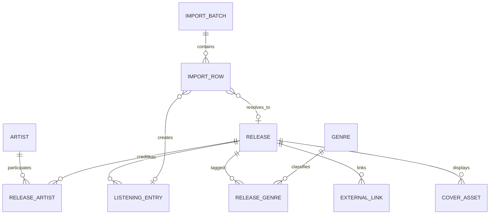

# RecordShelf：个人音乐打分与听歌档案

> 文档类型：Spec-first 产品需求与实现规格  
> 状态：v0.3 Draft  
> 更新日期：2026-07-26  
> 默认语言：简体中文  
> 目标读者：产品负责人、设计师、开发者、测试人员、编码 AI  
> MVP 定位：一个移动端与桌面端都好用的响应式 Web 应用，用于导入、维护、浏览和回顾个人音乐发行记录。  
> 参考气质：用户提供的 Record Club 截图；只借鉴其“封面优先、信息克制、高密度但不拥挤”的感觉，不复制品牌、图标或具体页面。

---

## 0. 给编码 AI 的执行约定

### 0.1 唯一真相源

本文件是 MVP 的产品与行为真相源。实现、设计稿、数据库、接口和测试不得与本文件冲突。

冲突时优先级从高到低为：

1. 第 17 章“验收标准”；
2. 第 9 章“数据模型”；
3. 第 7 章“功能规格”；
4. 第 10 章“CSV 导入规格”；
5. 第 11 章“流媒体匹配规格”；
6. 其他说明。

最重要的数据原则：

> “音乐发行”与“我的一次听歌/评分记录”必须分开存储。  
> 修改当前分数不能覆盖过去的听歌日期、评分和当时评论。

### 0.2 开始编码前

编码 AI 必须先：

1. 完整阅读本文件；
2. 检查项目内是否已有用户数据、数据库 schema、CSV 样例、视觉资产或同名功能；
3. 输出不超过 15 行的实现计划；
4. 列出计划创建或修改的目录；
5. 列出需要的环境变量以及哪些功能会在缺少凭证时降级；
6. 建立数据库迁移，不以运行时自动建表代替迁移；
7. 为 CSV 导入、评分换算、去重和平台匹配先写测试，再实现界面。

若没有真正阻塞的问题，直接按本文档默认值实施，不重复询问已经明确的需求。

### 0.3 禁止行为

编码 AI 不得：

- 伪造 Apple Music、Spotify、NeoDB 或其他平台的精确详情 URL；
- 把搜索页标记成“已匹配的专辑页”；
- 在浏览器端暴露平台密钥、数据库管理密钥或服务端 secret；
- 静默覆盖已有记录；
- 把同一张发行的不同听歌记录合并成一条；
- 未经确认把重制版、豪华版、现场版或同名专辑当成同一版本；
- 为了界面完整而自动生成不存在的发行日期、流派或封面；
- 抓取受登录、验证码、robots、反爬或服务条款限制的页面；
- 在 MVP 中增加社交 feed、关注、点赞、付费或站内完整音乐播放。

---

## 1. 产品摘要

### 1.1 一句话介绍

RecordShelf 是一个个人音乐档案：把散落在 NeoDB、Rate Your Music、AOTY、豆瓣等平台的听歌记录导入到同一个地方，以唱片封面为主进行浏览，并保留每次听歌时的日期、评分和评论。

### 1.2 核心价值

用户可以：

- 一眼浏览自己听过的 LP、EP、Single 等音乐发行；
- 在列表、宫格和唱片墙之间切换；
- 按歌手聚类查看自己的完整收听轨迹；
- 查看某张唱片每一次听过、评分和评论的时间线；
- 用 10 分制打分，并以 5 颗星、每半颗星 1 分的方式展示；
- 导入 CSV，也能手动新增和编辑；
- 自动寻找 Apple Music 和 Spotify 的专辑链接，一键跳转回听；
- 随时导出自己的完整数据，不被平台锁定。

### 1.3 产品原则

1. **封面是第一阅读层。** 元数据帮助识别，但不与封面争夺注意力。
2. **历史不可覆盖。** 每一次收听、评分和评论都是一个时间快照。
3. **匹配必须诚实。** 不确定的 Apple Music/Spotify 候选必须让用户确认。
4. **导入可预览、可撤销。** 任何批量写入前都先展示结果。
5. **移动端不是缩小的桌面端。** 三种视图均需为触屏单独设计。
6. **个人数据可带走。** 用户能导出原始字段和系统补全字段。
7. **先做好单人档案。** MVP 不做社区和算法推荐。

### 1.4 默认产品形态

- 单一 owner 使用。
- `/` 可配置为公开只读档案；默认公开展示发行资料、评分和评论。
- `/admin` 及所有写操作必须登录。
- 设置中允许一键把整个站点改为私密，私密模式下未登录用户看不到任何记录。
- MVP 为响应式 Web/PWA，不分别开发原生 iOS、Android 应用。

---

## 2. 背景、问题与目标

### 2.1 当前问题

个人听歌记录分散在多个平台，常见问题包括：

- 平台字段不一致，LP、EP、Single 的分类方式不同；
- 评论和评分与平台绑定，无法形成自己的长期档案；
- 同一歌手的记录分散在时间线中，不方便整体回看；
- 平台的浏览方式固定，不能自由切换列表、宫格与唱片墙；
- 想回听时需要再次搜索 Apple Music 或 Spotify；
- 更换平台时，评分日期和当时评论容易丢失。

### 2.2 MVP 目标

- 让用户在 5 分钟内完成第一次 CSV 导入。
- 一次导入 5,000 条记录时，页面不崩溃且可获得逐行结果。
- 三种浏览视图都能在 390 px 手机与 1440 px 桌面宽度下使用。
- 用户能在 3 次点击内从首页打开某张唱片的历史记录。
- 用户新增或修改一条听歌记录时，不破坏旧历史。
- 对具备足够信息的记录，后台自动生成 Apple Music/Spotify 候选。
- 自动匹配错误不会直接污染正式链接；中等置信度必须人工确认。
- 用户能完整导出自己的数据与平台链接。

### 2.3 成功指标

| 指标 | MVP 目标 |
|---|---:|
| CSV 有效行成功导入率 | ≥ 99% |
| 重复导入同一文件而新增重复事件 | 0 |
| 已有封面的网格首屏 LCP | ≤ 2.5 秒 |
| 常用筛选响应时间（5,000 条数据） | ≤ 300 ms |
| 自动标记“已确认”的流媒体链接人工正确率 | ≥ 95% |
| 单个平台失败导致详情页不可用 | 0 |
| 管理操作可由键盘完成 | 100% 核心流程 |
| 导出记录数与数据库可导出记录数一致 | 100% |

### 2.4 非目标

MVP 不包括：

- 社交关注、点赞、动态流或多人评论；
- 音乐推荐算法；
- 站内播放完整音乐；
- 自动同步 RYM、AOTY 或豆瓣账号；
- 对 NeoDB 执行任何写入、删除或修改；MVP 仅通过官方只读授权读取用户收藏；
- 未获授权的网页抓取；
- 曲目级评分；
- 播放次数自动采集；
- 原生移动 App；
- 多用户注册系统；
- 公开排行榜；
- AI 自动改写用户评论。

---

## 3. 用户与权限

### 3.1 Owner

唯一拥有写权限的档案主人，可以：

- 导入、创建、编辑、合并和删除记录；
- 确认或拒绝流媒体匹配；
- 管理公开性；
- 导出和备份全部数据；
- 修改封面、发行类型、流派和艺人关系。

### 3.2 Visitor

在公开模式下可以：

- 浏览、搜索、筛选和切换视图；
- 打开详情与历史时间线；
- 跳转 Apple Music、Spotify 和来源页面。

Visitor 不可看到：

- 导入批次、错误原因、内部备注；
- 未确认的平台匹配候选；
- 后台任务状态；
- 管理按钮；
- 被 owner 标记为私密的单条记录。

### 3.3 权限规则

- 所有 `POST`、`PATCH`、`DELETE` 请求都必须服务端鉴权。
- 前端隐藏管理控件不能替代服务端权限检查。
- 删除与合并属于高风险操作，必须二次确认。
- 删除默认使用软删除，30 天内可恢复。

---

## 4. 信息架构与路由

| 路由 | 用途 | 权限 |
|---|---|---|
| `/` | 全部发行记录；列表/宫格/唱片墙 | 公开或登录 |
| `/artists` | 艺人索引与艺人聚类总览 | 公开或登录 |
| `/artists/:slug` | 单个艺人的发行与个人收听轨迹 | 公开或登录 |
| `/releases/:id` | 发行详情、当前评分与历史时间线 | 公开或登录 |
| `/settings/duplicates` | 设置内的疑似重复条目审核与人工保留/删除 | Owner |
| `/sync` | “设置 → NeoDB 同步”的子页面：只读授权、增量对比与同步状态 | Owner |
| `/admin/add` | 手动新增发行和听歌记录 | Owner |
| `/admin/import` | CSV 上传、映射、预览与提交 | Owner |
| `/admin/matches` | Apple Music/Spotify 待确认候选 | Owner |
| `/settings` | 设置入口：资料管理、隐私、默认地区、导出与备份 | Owner |
| `/settings/artists` | 艺人身份、别名、原始署名与外部 ID 管理 | Owner |
| `/login` | Owner 登录 | 公开 |

移动端可以使用底部导航；桌面端使用顶部导航或左侧窄导航。二者必须对应同一信息架构，不创建移动端专属数据页面。

---

## 5. 核心用户故事

### US-01：浏览全部记录

作为用户，我想快速浏览所有听过的发行，并看到封面、标题、艺人、类型和评分。

### US-02：切换展示方式

作为用户，我想在列表、宫格和唱片墙之间切换，以便分别进行精确查找、日常浏览和纯视觉回顾。

### US-03：按艺人聚类

作为用户，我想按艺人分组查看发行记录，以便回顾自己对某位艺人的收听轨迹。

### US-04：查看当时的想法

作为用户，我想打开一张唱片，看到自己在不同时间听过它时的评分与评论，而不是只看到最后一次修改后的结果。

### US-05：CSV 导入

作为用户，我想导入现有 CSV，并在提交前确认字段映射、错误与重复项。

### US-06：手动添加

作为用户，我想用专辑名、艺人名和封面快速新增记录，再补充发行日期、类型、流派、评分与评论。

### US-07：10 分制评分

作为用户，我想选择 1–10 分，界面同时显示对应的 0.5–5 星，例如 9 分显示为 4.5 星。

### US-08：一键回听

作为用户，我想点击 Apple Music 或 Spotify 按钮，直接打开正确的专辑详情页。

### US-09：纠正匹配

作为用户，我想在自动匹配不确定时选择正确版本、拒绝候选或粘贴自己的链接。

### US-10：数据可带走

作为用户，我想导出完整 CSV 和 JSON，其中包含历史记录，而不是只有当前分数。

### US-11：NeoDB 增量同步

作为用户，我希望只同步 NeoDB 中新增或确有变化的收藏，而不是每次重新扫描并重复导入整个收藏。

### US-12：人工处理疑似重复

作为用户，我希望查看重复候选各自的评分、时间与评论，再明确决定保留和删除哪一条。

---

## 6. 核心流程

### 6.1 首次使用与导入

1. Owner 登录后进入空状态。
2. 页面提供两个等权入口：`导入 CSV`、`手动添加第一张唱片`。
3. 上传 CSV 后系统读取表头并自动建议字段映射。
4. 用户确认或修正映射。
5. 系统展示预览：
   - 可导入；
   - 需要补充；
   - 疑似重复；
   - 无法导入。
6. 用户选择对重复项的处理方式。
7. 系统以一个导入批次提交。
8. 提交后后台异步补全封面与流媒体候选。
9. 页面立即显示已导入的本地记录，不等待平台补全。
10. 导入结果可下载为错误 CSV，也可整批撤销。

### 6.2 手动新增

1. Owner 点击全局 `+`。
2. 首屏只要求：
   - 发行标题；
   - 至少一位艺人；
   - 听歌日期；
   - 评分（可空）。
3. 输入标题与艺人后，系统延迟搜索元数据与平台候选。
4. 用户可从候选带入封面、日期和链接，也可完全手填。
5. 用户填写评论并保存。
6. 保存成功后打开详情页，并在后台继续处理未完成匹配。

### 6.3 再次听同一张唱片

1. 用户在详情页点击 `记录这次收听`。
2. 新建一条 Listening Entry。
3. 默认带入今天的日期；评分和评论为空。
4. 保存后时间线新增一条事件。
5. 详情顶部的“当前评分”更新为最新一条非空评分。
6. 过去评分与评论保持不变。

### 6.4 按艺人浏览

1. 用户将“组织方式”切换为 `按艺人`，或进入 `/artists`。
2. 默认先展示轻量的艺人索引，不得同时渲染每位艺人的完整唱片网格；每个索引项显示：
   - 艺人名；
   - 已听发行数量；
   - 平均当前评分；
   - 代表性发行封面；
   - 已维护的主要别名。
3. 艺人索引按批次加载；点击艺人后只渲染该艺人的发行。
4. 艺人分组使用稳定 `artist_id`，不直接以当前显示字符串作为身份。
5. 合作发行必须出现在每一位相关艺人的页面中，但全局计数只算一张发行。
6. 唱片卡片和详情始终保留导入时的完整原始署名；身份映射只影响搜索、聚类与艺人页导航。

### 6.5 一键回听

1. 用户在卡片快捷菜单或详情页点击平台按钮。
2. 只有 `confirmed` 链接显示为明确的平台 CTA。
3. 网页新标签打开平台的精确专辑详情 URL。
4. 移动浏览器允许平台自行唤起 App；本产品不强制构造私有 URL scheme。
5. 没有确认链接时显示 `查找收听链接`，进入候选确认，不伪装成可播放。

### 6.6 与 NeoDB 增量同步

1. 用户从“设置 → NeoDB 同步”进入同步页；产品不再设置含义重复的“我的”入口，也不在主导航重复放置同步。
2. 未授权时，在当前页面引导用户完成 NeoDB 官方只读授权；授权成功后自动继续。
3. 系统读取 `complete`、`progress`、`wishlist`、`dropped` 四种收藏状态，并与本地同步状态进行增量比较。
4. 新增记录和确有变化的记录自动写入或更新；完全相同的唱片与听过记录不重复导入。
5. 远端缺失项只展示为待确认移除，不自动删除本地数据，也绝不修改 NeoDB。
6. 用户可选择“完整校对”进行全量检查；日常同步默认只扫描最新页和轮换审计页。

### 6.7 处理疑似重复条目

1. 系统将最终解析到同一规范 NeoDB 地址的本地记录列为疑似重复。
2. 系统不得仅凭相似标题、译名或艺人名自动合并。
3. 页面并列展示候选项的来源、评分、收藏状态、听过时间和完整评论。
4. 用户选择要保留的记录，并明确确认删除其他记录。
5. 删除候选项时不得把其评分、评论或历史静默合并到保留项。

---

## 7. 功能规格

### 7.1 全局浏览

#### FR-001 三种视图

必须提供：

1. `列表`
2. `宫格`
3. `唱片墙`

视图偏好保存在用户设置，并同时写入 URL 查询参数，例如：

```text
/?view=grid&group=artist&types=LP,EP&sort=listened_desc
```

直接打开带参数 URL 时，应恢复相同视图和筛选；无效参数回退默认值。

#### FR-002 宫格

每个卡片默认显示：

- 1:1 封面；
- 发行标题，最多两行；
- 主要艺人，最多一行；
- 类型小标签；
- 10 分制数字；
- 5 星视觉表示；
- 最近听歌日期（桌面默认显示，手机可在紧凑模式隐藏）。

整张卡片可打开详情。平台按钮与更多菜单必须是独立可点击区域，不能触发卡片跳转。

#### FR-003 列表

桌面端列：

- 封面；
- 标题；
- 艺人；
- 类型；
- 发行日期；
- 流派；
- 当前评分；
- 最近听过；
- 平台；
- 更多操作。

手机端改为双行列表项，不横向塞入完整表格：

- 左侧 56–64 px 封面；
- 中间标题、艺人、类型和日期；
- 右侧评分与更多菜单。

#### FR-004 唱片墙

唱片墙以封面为主，不在每张封面下持续显示文字。

- 手机：3 列为默认；宽屏手机可 4 列。
- 平板：5–6 列。
- 桌面：根据容器宽度自适应 7–10 列。
- 间距 2–8 px，可在设置中选择 `紧密` 或 `舒展`。
- hover、键盘 focus 或轻点后显示标题、艺人、评分与操作。
- 再次点击或按 Enter 打开详情。
- 无封面时显示带发行标题首字和中性色块的占位图，不能破坏网格比例。

#### FR-005 组织方式

全局浏览支持：

- `全部发行`：平铺；
- `按艺人`：艺人分组；
- `按年份`：以发行年份或听歌年份分组，用户可切换；
- `按类型`：LP、EP、Single 等分组。

MVP 的默认组织方式为 `全部发行`。

疑似重复条目不属于音乐库的组织方式；入口位于“设置 → 资料管理 → 疑似重复条目”。

合作艺人的署名必须拆分用于匹配和聚类，但界面仍显示完整署名。例如搜索或进入 Charli xcx 时，`Charli xcx/Billie Eilish` 的合作作品应进入 Charli xcx 的同一个艺人结果区块，不另建重复的组合艺人结果。

### 7.2 搜索、筛选与排序

#### FR-006 搜索

搜索结果分为两个层级，默认优先满足用户查找唱片或艺人的意图：

- **直接命中：**仅匹配发行原名和艺人署名，作为主要唱片结果展示。
- **间接命中：**匹配评论、译名、副标题、标题别名、流派或标签时，独立放入“评论与其他文字”模块。
- 间接命中不得混入主要唱片结果；卡片须展示命中的字段，并在评论或文字片段中高亮搜索词。
- 外部平台 ID 或 URL 可用于定位，但不作为面向用户的主要结果类型。
- 同一发行在同一模块中只出现一次。

搜索大小写不敏感，支持 Unicode；中文不要求分词引擎，但必须支持连续子串匹配。搜索输入框只显示产品自定义的一个清除按钮，隐藏浏览器原生 `search` 清除按钮，避免出现两个“×”。

#### FR-007 筛选

必须支持：

- 发行类型：LP、EP、Single、Compilation、Mixtape、Live、Soundtrack、Other；
- 当前评分：未评分、1–10、分数区间；
- 发行日期范围；
- 标记时间范围；
- 第一次或最近一次听过的日期范围；
- 艺人及其已确认别名；
- 流派与风格；
- 目录语言；
- 版本类型：标准版、Deluxe、Remaster、Anniversary、Expanded 等；
- 发行国家或地区、厂牌、载体格式；
- 是否有评论；
- 收听次数；
- NeoDB 收藏状态；
- 是否有封面、发行日期、发行类型、流派、目录语言或流媒体链接；
- Apple Music、Spotify、NeoDB 链接状态；
- 数据可信度：精确来源、用户确认、待复核；
- 公开/私密。

多个不同筛选维度取交集；同一维度内多选取并集。

筛选字段分为两类：

1. **本地可靠字段：**评分、评论、听过记录、标记时间、NeoDB 收藏状态、已确认艺人身份、已保存外链、用户手动输入的数据。它们可以立即参与筛选。
2. **外部核验字段：**流派、风格、目录语言、版本类型、发行国家或地区、厂牌、载体格式。只有精确关联来源返回明确结构化字段，或用户亲自确认后，才可以写入并参与筛选。

外部核验字段必须同时保存字段值、来源、精确关联对象 ID 或 URL、核验时间与状态。系统不得执行下列推断：

- 不得把 NeoDB 的用户标签或收藏标签直接写成流派或风格；
- 不得根据艺人国籍、艺人姓名、标题字符或封面文字猜测目录语言；
- 不得根据标题中的普通词语猜测流派、风格、国家、厂牌或载体；
- 不得把模糊搜索候选、低置信度匹配或存在冲突的结果写入正式字段；
- 不得用 Spotify Album 的空流派字段反向断言“没有流派”。

“目录语言”指发行标题与曲目标题在目录中的语言，不等同于演唱或歌词语言。MVP 不提供歌词语言筛选，除非未来接入能够明确提供且可核验该字段的来源。

当外部核验字段暂无可信值时：

- 筛选面板保留该维度并显示“暂无已核验数据”，不得展示自动猜测的选项；
- 数据完整性筛选可将其列为“缺少流派”“缺少目录语言”等待处理项；
- 用户可在后续编辑或设置管理中补充并确认；
- 日期范围启用后，无日期或日期存在未解决冲突的记录排除在结果外；未启用日期筛选时不受影响。

#### FR-008 排序

必须支持：

- 最近听过；
- 最早听过；
- 最近添加；
- 发行日期新到旧；
- 发行日期旧到新；
- 评分高到低；
- 评分低到高；
- 标题 A–Z；
- 艺人 A–Z。

默认排序为 `最近听过`，没有听歌日期的记录排在有日期记录之后。发行日期未知或存在来源冲突的记录，在发行日期升序和降序中都必须排在末尾。

#### FR-009 活跃筛选状态

- 筛选按钮显示已启用条件数量。
- 活跃条件以可单独移除的 chips 展示。
- 提供 `清除全部`。
- 手机端筛选在底部 sheet 中完成；桌面端可用右侧 panel。

### 7.3 发行详情

#### FR-010 详情头部

详情页必须显示：

- 大封面；
- 发行标题；
- 全部艺人；
- 发行类型；
- 首发日期及其精度；
- 流派；
- 当前评分：`9/10 · 4.5/5`；
- 最近听过日期；
- 已记录次数；
- 已确认的 Apple Music/Spotify 按钮；
- 原始来源链接，例如 NeoDB、RYM、AOTY、豆瓣；
- Owner 的编辑和新增收听入口。

艺人署名必须是可操作入口：

- 单艺人点击后进入该艺人的作品集合；
- 合作署名拆成每位参与艺人的独立链接，界面仍以原始完整 credit 顺序显示；
- 已建立别名映射时按稳定 Artist ID 进入统一艺人页，未映射署名进入对应原始署名结果；
- 进入艺人页时清除详情打开前的搜索词，避免只显示搜索子集；当前视图类型继续保留；
- 从音乐库详情临时进入艺人页时，须保存原发行详情 URL、滚动位置、搜索、筛选、排序、视图和当前加载批次；随后点击“音乐库”或使用浏览器返回，恢复原详情抽屉及背景位置，而不是回到音乐库顶部；
- 链接须支持键盘聚焦，并有“查看该艺人全部作品”的可访问名称。

#### FR-011 历史时间线

每条时间线事件显示：

- 听歌日期与时间；只有日期时不伪造具体时间；
- 打分时间；
- 当次评分；
- 对应星级；
- 当时评论；
- 来源平台；
- 导入时间；
- 后续编辑标记。

排序默认最新在前，可切换为最早在前。

若旧数据只有“评分日期”而没有“听歌日期”：

- `rated_at` 保留原日期；
- `listened_at` 保持 `null`；
- UI 显示 `听歌日期未记录`；
- 不得把导入日期当成听歌日期。

#### FR-012 当前评分计算

```text
current_rating_10 =
  按 rated_at DESC、created_at DESC 排序后的第一条非空评分
```

- 没有评分时为 `null`，UI 显示 `未评分`。
- `null` 与 `0` 不等价。
- 删除最新事件后重新计算。
- 平均评分只对非空评分计算。

### 7.4 评分

#### FR-013 评分规则

- 数据库存储整数 `1–10`。
- 空值表示未评分。
- 星级只用于输入与展示，换算为 `rating_10 / 2`。
- 支持半星，不支持四分之一星。

| 10 分制 | 星级 |
|---:|---:|
| 1 | 0.5 |
| 2 | 1.0 |
| 3 | 1.5 |
| 4 | 2.0 |
| 5 | 2.5 |
| 6 | 3.0 |
| 7 | 3.5 |
| 8 | 4.0 |
| 9 | 4.5 |
| 10 | 5.0 |

#### FR-014 评分控件

- 视觉上使用 5 颗星。
- 指针移动或触摸时，每颗星分左右两半。
- 键盘用户使用 10 个明确的单选值。
- 屏幕阅读器文案必须是 `9 分（满分 10 分），4.5 星`，不能只读出“4.5”。
- 选中后同时显示数字分，避免半星图标含义不清。
- 提供 `清除评分`，其结果是 `null`。

### 7.5 手动新增与编辑

#### FR-015 新增字段

最小必填：

- `title`：发行标题；
- `artists`：至少一位艺人。

推荐填写：

- 发行类型；
- 发行日期；
- 听歌日期；
- 评分；
- 评论；
- 封面；
- 流派；
- NeoDB/RYM/AOTY/豆瓣来源 URL。

#### FR-016 艺人输入

- 支持搜索已有艺人；
- 支持即时创建新艺人；
- 支持多位艺人；
- 支持指定主要艺人；
- 艺人显示名与用于去重的规范化名分开；
- 不把 `Artist feat. Guest` 强行存成一个艺人字符串。

#### FR-017 封面

封面可以来自：

- 用户上传；
- CSV 中的图片 URL；
- 用户确认的平台候选；
- 其他合法元数据源。

要求：

- 支持 JPG、PNG、WebP；
- 上传上限默认 10 MB；
- 生成 256、512、1024 px 方形或等比例缩略图；
- 原图不强制裁成方形；
- UI 默认 `object-fit: contain`，背景取中性色；
- 用户可选择安全裁切区域，但不得自动永久覆盖原图；
- 图片失败时使用占位图并允许重试。

#### FR-018 编辑审计

对以下字段变更写入审计记录：

- 标题；
- 艺人；
- 类型；
- 发行日期；
- 封面；
- 平台链接；
- 评分事件；
- 评论；
- 公开性。

MVP 只需 owner 可见的简要变更历史，不要求可视化 diff。

### 7.6 删除、合并与恢复

#### FR-019 删除

- 删除发行默认软删除，并连同关联记录从公开页面隐藏。
- 30 天内可恢复。
- 永久删除需要再次输入发行标题确认。

#### FR-020 合并重复发行

只有 Owner 主动执行“合并”操作时，选择主记录与重复记录后才可以：

- Listening Entry 全部迁移到主记录；
- 不重复的平台链接保留；
- 冲突字段逐项选择；
- 原记录保存合并指向；
- 合并可在 30 天内撤销。

“疑似重复条目”的默认处理不是自动合并。系统必须先展示差异，并让用户明确选择保留与删除；不得因标题相似或艺人相同而自动迁移评论和评分。

### 7.7 导出

#### FR-021 数据导出

至少支持：

- `records.csv`：一行一个 Listening Entry，重复发行字段；
- `releases.csv`：一行一个发行；
- `listening_entries.csv`：一行一次听歌/评分事件；
- `full-export.json`：包含所有实体、关系、平台链接与审计元数据。

导出必须：

- 使用 UTF-8；
- 保留评论换行；
- 使用 ISO 8601 时间；
- 包含 schema version；
- 不包含密码、token、内部 secret；
- 可重新导入到同版本应用。

### 7.8 NeoDB 官方只读同步

#### FR-022 导航与授权

- 桌面端侧栏和移动端底部导航不单列“同步”或“我的”；“设置”作为最后一项，并在数据分组中提供“NeoDB 同步”子项。
- 只使用 NeoDB 官方只读 OAuth 能力；产品不得替用户修改、删除或新增 NeoDB 内容。
- 访问令牌只保留在当前会话，不写入导出文件、日志或可公开的前端数据。
- 如需登录，须在同步页原地提示；授权完成后自动返回并继续对比。

#### FR-023 同步范围与字段语义

- 同步范围覆盖 `complete`、`progress`、`wishlist`、`dropped`，不得只读取 `complete` 后把其他收藏误判为删除。
- 保留 NeoDB 原始收藏状态。
- `wishlist` 的日期表示标记/想听日期，不得解释为听过日期或评分日期。
- 新增、评分变化、评论变化、时间变化或收藏状态变化均视为有效变化；没有上述变化时视为同一内容。
- 对本轮新增或确有变化的唱片，在写入前执行发行类型校验；无变化条目不得为了类型轮询而反复访问外部平台。
- 同步只作用于本地音乐库，任何“移除”文案都必须明确表示“从本地移除”。
- 普通同步的主要按钮须使用“同步新增与变化”等能说明结果的文案，并在旁边明确说明“只写入新增或确有变化的记录”；不得使用含义不清的“确认同步”。
- “完整校对”与普通同步是两个不同重量的操作。完整校对须说明会扫描四种收藏状态并核验全部本地 NeoDB 地址，但仍不会自动删除本地数据。
- 待移除操作必须与普通同步结果分区展示。只有满足 FR-024 移除保护后，才显示“确认从本地移除 N 项”；不得让用户误以为点击普通同步会执行删除。

#### FR-024 增量对比策略

- 本地保存上次同步所需的规范 NeoDB 条目 ID、内容指纹、页游标、轮换审计位置、远端数量与同步时间。
- 日常同步只读取最新若干页和一批轮换审计页；评论和日志只为新增或指纹变化的条目读取。
- 普通同步分为两个反馈阶段：先完成 NeoDB 增量对比并立即写入新增、评分、评论、时间和收藏状态变化；旧地址轮换审计与发行类型核验随后作为后台校验继续，不得阻塞第一阶段结果展示。
- 四种收藏状态的轮换审计页应并行读取；只有明确的完整校对允许按全库重操作执行。
- 日常同步同时轮换核验一小批本地 NeoDB URL 的最终跳转地址；“完整校对”核验全部本地 NeoDB URL，不要求每次普通同步全量检查。
- 只有远端总量下降、同步状态不可用或用户主动选择“完整校对”时，才进行全量扫描。
- 新增和修改可自动写入本地；远端缺失只进入待确认列表，未经用户确认不得删除本地记录。
- “远端缺失”必须在完整读取四种收藏状态后，先把本地与远端 ID 都映射到最终规范 NeoDB 地址再计算；旧 ID、合并地址或跳转地址不得被列为本地独有。
- 同一规范条目须在连续两次完整核对中都缺失，第二次才可进入“待确认移除”；第一次仅显示“需要再次复核”，不得提供删除按钮。任一次重新出现都会把连续缺失计数清零。
- 旧版本在最终地址核验前生成的待移除项属于不可信状态，升级后必须自动清空，不得继承为可删除候选。
- 已确认映射到同一规范 NeoDB 地址的条目，后续同步必须复用该映射，不得再次新增。

### 7.9 唯一性、历史去重与疑似重复条目

#### FR-025 NeoDB 规范身份

- 同步或导入时同时保留原始 NeoDB URL 与最终规范 URL。
- 身份比较前必须解析 NeoDB 旧地址或跳转地址；最终规范 URL 相同才视为同一 NeoDB 唱片。
- 每次同步须先把新发现的跳转/合并地址与本地全部发行身份对照；旧 URL、旧条目 ID 和最终规范 URL 的映射必须持久化供后续同步复用。
- 已存在规范 NeoDB 唱片时执行字段更新，不新建第二张发行。
- 标题、译名或艺人名称的模糊相似只能用于提示，不可作为自动合并依据。

#### FR-026 听过记录语义去重

同一规范 NeoDB 唱片下，两条听过/评分记录仅在以下字段全部相同时视为同一记录：

- 实际时间点相同；不同 ISO 表达先统一到同一时间点再比较；
- 评分相同；
- 评论在统一换行和首尾空白后相同；
- 收藏状态相同。

命中时优先复用现有记录，不重复插入。时间、评分、评论或状态任一确有差异时，保留为独立历史。评论不得单独用于识别唱片，但必须参与判断两次记录是否完全相同。

#### FR-027 疑似重复条目审核

- 在“设置 → 资料管理”中提供“疑似重复条目”入口，不与“全部发行”“按艺人”并列为音乐库组织方式。
- 分组条件为最终规范 NeoDB URL 完全相同。
- 同步发现 NeoDB 条目合并或地址跳转后，如两个既有本地发行落到同一规范 URL，须立即生成疑似重复组并在同步结果中提示；不得自动删除、合并或替用户选择保留项。
- 每个候选项必须展示有助判断的差异，尤其是评论、评分、时间、状态和来源。
- 用户必须选择保留项并确认删除项；默认不自动合并。
- 删除的记录不得把评论、评分或时间线静默迁移到保留项。

#### FR-027A 发行详情中的手动合并

- 发行详情底部提供“合并其他条目”入口，默认收起，避免与日常收听操作混淆。
- 用户可输入音乐库中另一条 RecordShelf 发行详情链接，或该记录的 NeoDB、Apple Music、Spotify 唱片链接；详情链接按 `/releases/:id` 精确定位，外部链接按同一平台的规范 URL 精确定位，不使用标题、艺人或评论模糊匹配。
- RecordShelf 详情链接只接受当前站点同源 URL、`127.0.0.1` / `localhost` 本地 URL 或站内相对路径，并要求 ID 在当前音乐库中真实存在。外部链接模式下，当前发行必须已经拥有输入链接所属平台的记录。
- 链接指向当前发行、ID 不存在、外部平台不一致、未命中或一次命中多条时停止流程并解释原因，不改变音乐库。
- 精确命中后并列展示当前条目与链接命中条目的封面、标题、艺人、评分、评论和收听历史数量。用户必须明确选择保留项，不提供默认选择。
- 用户点击确认后再显示包含保留项、删除项和数据迁移说明的二次确认；取消时不得写入任何变化。
- 确认合并时，以用户选择的发行 ID、主标题、封面和同平台外链为最终身份；另一条独有的 Listening Entry、评分、评论、别名、已核验元数据及不冲突的平台外链合入保留项。
- Listening Entry 按 FR-026 语义去重，完全相同内容不得重复；有实际差异的历史必须全部保留。同平台冲突外链不得覆盖用户选择的保留链接，但来源 ID/URL 映射须保留，避免后续同步重新导入被删除项。
- 数据合并完成后删除未保留的 Release 及其发行级覆盖，并停留在保留项详情。操作结果须明确说明合入的独有历史数量。
- “设置 → 疑似重复条目”的默认“保留并删除”仍遵守 FR-027，不静默迁移历史；只有用户主动从详情页进入本流程，才执行上述显式数据合并。

### 7.10 精准元数据补全

#### FR-028 原名、译名与艺人

- 主标题优先使用该发行正式使用的原语言唱片名。“原语言”指该版本实际发行标题的语言，不等同于艺人的国籍、母语或所在国家；例如瑞典艺人发行的英语标题仍以英语标题为主。
- 只有精确关联来源明确提供主标题时，才可提升或替换主标题。可接受的证据包括已确认的 Apple Music/Spotify 专辑页、MusicBrainz 精确 Release/Release Group、NeoDB 精确条目的结构化字段，或已关联豆瓣条目明确区分的“标题/又名”。
- 不得仅根据艺人国籍、字符是否为中文/拉丁字母、流派、封面文字或模糊搜索结果猜测原语言标题。
- CSV 或 NeoDB 的原始导入标题与可靠原名不同时，必须保留为 `translatedTitle` 或 `titleAliases`，以“原名 + 译名/别名”形式辅助展示，不得丢弃。
- 每条已核验标题证据须保存：规范标题、译名/别名、来源、精确来源 URL、核验时间；重新导入 CSV 或再次同步后必须重新应用，不得退回错误的译名主标题。
- 同步须保存该规范 NeoDB 条目上次见到的来源标题。后续同一规范条目标题发生变化时，如果旧 NeoDB 标题原本就是主标题，或旧地址合并/跳转到新条目并伴随标题变化，则把新 NeoDB 精确标题提升为主标题，同时把旧主标题保留为可搜索别名。
- 仅在首次为既有记录补记 NeoDB 来源标题、但规范地址和来源标题没有可证明的“前后变化”时，不得覆盖已经由精确 Apple Music、Spotify 或 MusicBrainz 证据确认的原语言主标题。
- 用户明确确认的主标题优先于自动同步；自动同步不得静默覆盖人工标题。
- `Deluxe`、`Bonus Edition`、`Remaster`、`Anniversary Edition`、`Expanded` 等版本限定词属于发行身份的一部分。精确来源确认当前链接指向该版本时，限定词必须保留在主标题中，不得为追求“简洁标题”而剥离。
- 普通版与 Deluxe/Bonus/Remaster 等版本须保持可区分的发行身份；同一基础标题不得导致两个版本互相覆盖或被自动视为同一发行。
- 基准目录升级后，如本地只残留旧版自动生成的“主标题/译名对调”覆盖，系统应安全清理该对调；用户明确手动设置且不符合对调特征的标题不得覆盖。
- 不进行全库自动机器翻译。
- NeoDB CSV 的 `info` 艺人字段按 `artist:<name>` 解析，只去掉最前面的 `artist:`，保留后续完整艺人名称。
- 若 `info` 返回 `/person/<id>` 或 `/organization/<id>`，该值是 NeoDB 实体路径而不是艺人显示名。只有在该路径能通过精确 NeoDB 实体、已关联 MusicBrainz/Apple Music 页面或用户确认解析为名称时才写入艺人；未解析路径不得直接显示或存为艺人名，导入时应标为待处理。
- 实体路径可能嵌在合作署名中，例如 `ROSÉ//person/<id>`。导入器须逐段解析并恢复成 `ROSÉ/Bruno Mars` 这类完整合作署名；不得因其中一位已经是可读名称而跳过其余路径，也不得把整个字段当作单一艺人。
- 合作署名拆分用于搜索和艺人聚类，展示时保留完整合作署名。

#### FR-029 封面与发行类型

- 封面只按已精确关联的发行链接补全。优先级为：精确 Apple Music 发行结果、精确 Spotify oEmbed、NeoDB 页面结构化/OG 图片、MusicBrainz Cover Art Archive。
- Apple Music 与 Spotify 对同一组已确认平台 ID 返回一致封面时，记录为精确平台共识；如果 NeoDB OG 图片与该共识不同，视为 NeoDB 图片缓存或条目图片可能陈旧，不得用 NeoDB OG 覆盖平台共识。
- 不同版本、再版、Deluxe 或同名发行必须分别使用各自外部链接对应的封面；封面不得仅因标题和艺人相同而跨 Release 复用。
- 不允许仅凭模糊标题自动套用封面。
- 发行类型必须有精确来源证据：Album 映射为 LP、EP 映射为 EP、Single 映射为 SINGLE；不确定时保留未分类/OTHER。
- NeoDB 同步中的新增与变化项须通过只读元数据接口核验类型。只允许使用已经精确关联到该唱片的 NeoDB 条目、MusicBrainz Release/Release Group、Discogs Release/Master，或已确认 Apple Music 唱片页中的明确官方 `EP` / `Single` 标题后缀；不得为了补类型执行模糊标题搜索。
- “变化项”须进一步按类型相关性筛选：新增、当前未分类、NeoDB 类型变化、正式标题变化、外部精确链接变化或条目合并时才进入类型校验；只有评分、评论、收听时间或收藏状态变化时不得重新请求元数据平台。
- 类型校验结果按“规范 NeoDB 地址 + 正式标题 + 艺人 + NeoDB 来源类型 + 精确外链”生成指纹并缓存 30 天。指纹未变时直接复用证据；任一类型相关字段变化或规范地址变化时立即失效并重新核验。
- 多个精确来源给出的 LP、EP、Single 结论一致时写入结果并保存来源、精确 URL、原始证据和核验时间；来源冲突、来源只给出笼统或其他类型、没有明确证据时写入 `OTHER`，交由用户处理。
- 外部平台暂时不可用属于“校验未完成”而非类型结论：新增项默认保持 `OTHER`；已有用户人工确认的类型和已有精确证据不得因临时网络失败被清空。
- 用户手动选择 LP、EP、Single 或未分类后标记为人工确认；后续自动同步不得覆盖这一选择，除非用户主动要求重新校验。
- 网格和详情页都应提供 LP、EP、Single 的快速人工编辑入口。

#### FR-030 发行日期

- 日期来源优先级与可用证据包括：已关联 NeoDB 的结构化日期、精确 Apple Music 结果、MusicBrainz、Discogs。
- 只有单一明确来源，或多个精确来源日期兼容时才写入；来源冲突、有争议或匹配不确定时留空。
- 按来源能确认到年、月或日的实际精度保存，不臆造缺失的月日。
- 保存日期来源、匹配方式和冲突状态，便于后续审计。
- 发行日期升序和降序排序中，空值始终排在末尾。

### 7.11 当前前端 MVP 的本地数据策略

#### FR-031 基准目录与用户变更分离

- 真实 CSV 转换后的发行目录作为随版本提供的只读基准数据。
- 浏览器持久化层只保存用户新增、编辑、删除、重复项处理和同步状态等增量变更，不复制整份基准目录。
- 读取时将“基准目录 + 用户增量”合成为当前音乐库；升级基准目录不得覆盖用户的手动修改。
- 删除使用稳定 ID 的 tombstone；不得因刷新、重新导入或更换视图而复活。
- 未来迁移到服务端数据库时，稳定发行 ID、Listening Entry ID、规范 URL 映射和历史记录必须保持不变。

### 7.12 设置与艺人身份管理

#### FR-032 设置入口

- 桌面端侧栏与移动端底部导航都提供“设置”入口；“同步”不再占用独立主导航位置。
- `/settings` 是可扩展的设置首页，首批包含“艺人管理”“疑似重复条目”“NeoDB 同步”和“数据导出”；后续唱片字段、厂牌、人物 ID、隐私与地区设置放入同一层级。
- “NeoDB 同步”入口导航到 `/sync`；同步页关闭或返回时回到 `/settings`，同步页显示期间主导航的“设置”保持选中。
- `/settings/duplicates` 提供基于规范 NeoDB URL 的疑似重复条目审核；旧 `/duplicates` 地址仅作为兼容入口。
- `/settings/artists` 提供艺人身份的创建、修改、删除、别名归入和 MusicBrainz Artist MBID 维护。
- 删除艺人身份只删除映射关系，不删除发行、听歌历史、评分、评论或原始艺人署名。

#### FR-033 艺人身份与别名

- 一个艺人身份拥有稳定 `artist_id`、主显示名、可选排序名、零到一个 MusicBrainz Artist MBID，以及多个精确别名。
- 例如 `魏如萱`、`魏如萱 Waa`、`Waa Wei` 可映射到同一个艺人身份；艺人页只出现一个“魏如萱”，并聚合三种署名的发行。
- 别名匹配先做 Unicode NFKC、大小写和连续空格规范化，然后执行完整字符串精确匹配；不得仅凭子串、相似拼写或同名自动归并。
- 新建艺人、修改主显示名或添加别名时，系统须检查现有主显示名、别名、MusicBrainz 候选名及确定性的简繁体变体。发现同名或已有识别结果时，先展示冲突身份和可用外部 ID；用户二次确认“同名但不同艺人”后才允许继续。
- 用户取消二次确认时不得新增、改名或转移别名，并应定位或提示已有艺人身份。
- 同一个规范化名字可以在用户明确确认后属于多个同名艺人；此时该名字标记为歧义，不得默认映射给第一个身份。相关原始署名保持待判断，直至有 MBID、作品归属或用户逐条确认等足够依据。
- 搜索主显示名或任一别名都必须命中该身份下全部发行；评论中偶然出现该名字仍遵守“评论与其他文字”独立结果规则。
- 新导入或 NeoDB 同步不得覆盖用户确认的艺人身份、主显示名、别名或外部 ID；未映射的新署名进入“待整理的原始署名”列表。
- 简繁体整理、MusicBrainz 核验和其他异步自动任务必须把结果合并到执行完成时的最新艺人状态，不得用任务启动时的旧快照覆盖用户期间新增、修改或删除的内容。
- 艺人身份每次持久化时保留最近 10 个去重恢复快照；主存储损坏时优先读取最近有效快照，不得直接写回默认数据覆盖用户编辑。
- 本地开发与验收统一使用固定 `4173` 端口，避免因端口变化形成彼此隔离的浏览器存储空间。
- 设置的数据区提供“合并 JSON 备份”：以当前资料为主，按稳定发行 ID、规范 NeoDB URL、Listening Entry 内容、艺人 ID 和 MBID 增量合并；不得整份覆盖或清空当前资料。
- 同一 Listening Entry 内容完全相同时只保留一次；同 ID 但评分、评论、时间或状态不同则保留为两条历史。合并前必须保留当前完整导出与艺人恢复快照。
- MusicBrainz alias 与 MBID 可作为建议和外部身份依据；导入前须展示差异。Rate Your Music 不作为自动抓取或后台同步来源。
- 合作署名先按既有分隔规则拆成各个 credit，再逐一解析艺人身份；唱片显示仍保留完整合作署名。

#### FR-034 MusicBrainz 核验、重名与简繁体

- 艺人管理首次进入时，对未核验、资料指纹变化或核验已超过 30 天的身份执行增量 MusicBrainz 核验；用户也可手动重新核验全部。
- 名称搜索结果本身不得自动写入 MBID。只有艺人名称或已知别名完整匹配，并且至少一张本地发行标题与该 MusicBrainz Artist 的 Release Group 精确匹配时，才可自动填写或确认 MBID。
- 已有 MBID 也必须用 MusicBrainz Artist 名称/别名和共同 Release Group 复核。证据不一致时保留原值但标记“需判断”，不得静默替换。
- 同一个 MBID 若出现在多个本地艺人身份上，显示重复警告和涉及的身份，不自动合并或删除。
- MusicBrainz 返回多个符合候选、没有共同作品或平台不可用时，不写入 MBID；候选与歧义说明保留给用户判断。
- MusicBrainz 请求遵守有联系信息的 User-Agent 和平均每秒不超过一次的访问节奏；按批次显示进度，不阻塞其他本地管理操作。
- 使用 OpenCC 生成简体、繁体艺人名字变体。对于用户已经建立的同一身份，可把确定性的字形变体保存为带来源的搜索别名。
- 把尚未映射的简繁体原始署名自动归入已有身份，或自动新建一个身份时，除简繁规范化结果相同外，还必须存在共同的精确唱片地址或完整发行标题；只有名字字形相同但作品不重叠时不得自动归并。
- OpenCC 别名、MusicBrainz 别名、用户别名分别保存来源。自动来源不得覆盖主显示名，用户可移除自动别名。

#### FR-035 艺人页视图

- 艺人索引支持宫格和列表，两种视图都进入同一个艺人身份详情。
- 艺人索引使用独立于唱片集合的排序语义：默认按已评分作品的当前平均分从高到低排列，并提供“艺人名称 A–Z”和“艺人名称 Z–A”。
- 按平均分排序时，无有效评分的艺人后置；平均分相同则先按发行数量从多到少，再按艺人排序名正序，保证结果稳定。
- 艺人索引不显示“最近听过”“发行日期”“唱片标题”等唱片级排序；进入具体艺人后恢复唱片级排序选项。
- “唱片墙”只在选中具体艺人、页面内容已经是唱片集合时提供；艺人索引层不显示无语义的唱片墙按钮。
- 进入具体艺人后支持宫格、列表和唱片墙，三种视图展示同一发行集合并保留 `view` URL 参数。
- 不得显示点击后没有内容变化的视图按钮。

---

## 8. 视觉与响应式规格

### 8.1 视觉方向

参考截图传达的感觉：

- 白色或温和近白底；
- 大量真实、多彩封面；
- 标题与控件使用近黑；
- 次级信息使用冷灰；
- 活跃状态使用一处克制的紫色；
- 星级使用暖黄/琥珀色；
- 通过间距、字号、分隔线组织内容，少用厚重卡片和阴影；
- 页面像一个个人唱片档案，而不是数据后台。

不得直接复制参考产品的：

- 品牌名；
- 图标造型；
- 头像或个人数据；
- 导航标签组合；
- 浮动按钮文案；
- 具体视觉资产。

### 8.2 建议设计 tokens

```css
--color-bg: #FAFAF8;
--color-surface: #FFFFFF;
--color-text: #222222;
--color-muted: #8A8A86;
--color-line: #E9E9E5;
--color-accent: #6C3BFF;
--color-rating: #F5B83D;
--color-danger: #C83D4A;

--radius-control: 10px;
--radius-panel: 16px;
--radius-cover: 3px;

--space-1: 4px;
--space-2: 8px;
--space-3: 12px;
--space-4: 16px;
--space-5: 24px;
--space-6: 32px;
--space-7: 48px;
```

最终实现可调整数值，但必须保持：封面小圆角、控件中等圆角、面板大圆角；不要把所有元素做成胶囊。

### 8.3 字体

- 优先系统无衬线字体，保证中英文混排。
- 正文手机不小于 14 px。
- 次级元数据不小于 12 px。
- 发行标题使用 500–600 字重。
- 长评论使用舒适行高 1.6–1.75，最大阅读宽度约 68 个中文字符。
- 最多使用两个字体家族。

### 8.4 布局断点

| 名称 | 宽度 | 行为 |
|---|---:|---|
| Mobile | `< 600 px` | 底部导航、筛选底部 sheet、3 列唱片墙 |
| Tablet | `600–1023 px` | 4–6 列、可选双栏详情 |
| Desktop | `≥ 1024 px` | 顶部/侧边导航、7–10 列、筛选侧栏 |
| Wide | `≥ 1440 px` | 内容最大宽度 1600 px，不无限拉伸 |

断点按内容需要微调，不以设备品牌为依据。

音乐库工具栏在窗口变窄时按以下优先级收缩：

1. 先隐藏“显示 x / y 张发行”的统计文字；
2. 再隐藏左侧 LP、EP、Single、未分类等类型快捷 Tab，筛选条件仍可从筛选面板访问；
3. 排序与视图切换保留到产品支持的最小默认宽度。

### 8.5 移动端要求

- 点击目标至少 44 × 44 CSS px。
- 底部导航不得遮挡最后一行内容。
- 用户持续下滑并离开首屏后，右下角显示“返回顶部”浮动按钮；按钮必须避开底部导航与安全区，点击后返回页面顶部。
- 导入表格不在手机上强行展示全宽列，改为逐行卡片预览。
- 详情首屏先显示封面、标题、评分和平台按钮；完整元数据在下方。
- 评论输入时底部保存按钮不被软键盘遮挡。
- 支持安全区 `env(safe-area-inset-bottom)`。

### 8.6 桌面端要求

- 主内容居中，左右留白。
- 可选择常驻筛选侧栏，但收起后不影响状态。
- 网格卡片宽度保持可读，不能为了填满屏幕让封面超过必要尺寸。
- hover 只增强信息，核心操作必须也能通过点击与键盘完成。
- 艺人管理等设置页的双栏布局不得使用会裁掉列表末尾的固定高度。视口高度不足时，页面或左侧列表须可滚动，右侧编辑区使用 `min-width: 0` 防止内容撑破。
- 设置页在移动端改为单栏或主从页面；任何艺人身份、别名、候选和保存操作都必须可到达，不得只在桌面尺寸完整展示。

### 8.7 状态设计

所有核心页面必须包含：

- 首次空状态；
- 筛选后无结果；
- 加载骨架；
- 部分封面失败；
- 平台匹配处理中；
- 平台未配置；
- 网络失败及重试；
- 导入部分成功；
- 权限失效；
- 删除后可撤销提示。

### 8.8 动效

- 视图切换 160–240 ms；
- 封面加载淡入；
- 分组展开使用高度/透明度过渡；
- 不使用持续漂浮、自动轮播或阻碍快速浏览的动效；
- 遵守 `prefers-reduced-motion`。

---

## 9. 数据模型

### 9.1 核心关系



### 9.2 Release

代表音乐发行本身，不代表某一次听歌。

```ts
type ReleaseType =
  | "LP"
  | "EP"
  | "SINGLE"
  | "COMPILATION"
  | "MIXTAPE"
  | "LIVE"
  | "SOUNDTRACK"
  | "OTHER";

type DatePrecision = "DAY" | "MONTH" | "YEAR" | "UNKNOWN";

interface Release {
  id: string;                       // UUID
  title: string;
  title_normalized: string;
  title_translated: string | null;
  title_aliases: string[];
  release_type: ReleaseType;
  release_date: string | null;      // YYYY-MM-DD；按 precision 解释
  release_date_precision: DatePrecision;
  release_date_source: string | null;
  release_date_match_evidence: Record<string, unknown> | null;
  release_date_conflict: boolean;
  genres: string[];
  styles: string[];
  catalog_languages: string[];      // 标题/曲目标题语言，不是歌词语言
  edition_types: string[];          // Deluxe、Remaster、Anniversary 等
  release_countries: string[];
  labels: string[];
  media_formats: string[];          // Digital、CD、Vinyl、Cassette 等
  metadata_evidence: Record<string, MetadataEvidence>;
  current_rating_10: number | null; // 缓存字段，可重新计算
  latest_listened_at: string | null;
  is_private: boolean;
  notes_internal: string | null;
  created_at: string;
  updated_at: string;
  deleted_at: string | null;
}

interface MetadataEvidence {
  source:
    | "USER_CONFIRMED"
    | "USER_PROVIDED_IMPORT"
    | "MUSICBRAINZ"
    | "APPLE_MUSIC"
    | "DISCOGS"
    | "NEODB";
  source_entity_id: string | null;
  source_url: string | null;
  match_status: "EXACT" | "USER_CONFIRMED" | "NEEDS_REVIEW" | "REJECTED" | "CONFLICT";
  verified_at: string;
}
```

日期精度规则：

- 只知道年份 `2024`：存 `2024-01-01`，precision=`YEAR`，UI 只显示 `2024`。
- 知道年月 `2024-06`：存 `2024-06-01`，precision=`MONTH`，UI 只显示 `2024-06`。
- 完整日期：precision=`DAY`。
- 不知道日期：`null` + `UNKNOWN`。

### 9.3 Artist

```ts
interface Artist {
  id: string;
  name: string;
  name_normalized: string;
  sort_name: string | null;
  slug: string;
  musicbrainz_mbid: string | null;
  musicbrainz_status: "UNVERIFIED" | "MATCHED" | "AMBIGUOUS" | "NEEDS_REVIEW" | "UNAVAILABLE";
  musicbrainz_checked_at: string | null;
  musicbrainz_audit_fingerprint: string | null;
  musicbrainz_evidence: Record<string, unknown> | null;
  musicbrainz_candidates: Record<string, unknown>[];
  identity_source: "USER" | "MUSICBRAINZ" | "IMPORT";
  created_at: string;
  updated_at: string;
}
```

`ArtistAlias` 包含：

- `id`
- `artist_id`
- `name`
- `name_normalized`
- `locale`
- `type`：`PRIMARY | ARTIST_NAME | CREDIT_VARIANT | SEARCH_ALIAS`
- `source`：`USER | MUSICBRAINZ | OPENCC | IMPORT`
- `is_ambiguous`：用户确认存在同名不同艺人时为 `true`
- `created_at`
- `updated_at`

`name_normalized` 默认唯一；当用户明确确认是同名不同艺人时允许出现多条，但必须标记为歧义，且不能直接用于自动归属发行。
发行的原始 `artist_credit` 不因建立、修改或删除艺人映射而被重写。

`ArtistExternalIdentity` 用于保存艺人外部实体映射，至少包含：

- `artist_id`
- `provider`：`NEODB | MUSICBRAINZ | APPLE_MUSIC | SPOTIFY | OTHER`
- `provider_entity_type`：例如 `person`、`organization` 或 `artist`
- `provider_entity_id`、原始 path 与规范 URL
- `display_name`
- `status`：`CONFIRMED | NEEDS_REVIEW | REJECTED`
- `match_evidence` 与 `verified_at`

NeoDB 的 `/person/<id>`、`/organization/<id>` 必须通过该映射解析，不得把 path 本身保存为 `ArtistAlias`。

`ReleaseArtist` 包含：

- `release_id`
- `artist_id`
- `position`
- `role`：`PRIMARY | FEATURED | COMPOSER | VARIOUS | OTHER`

同名艺人不能仅凭规范化名称自动合并；没有外部 ID 时标为疑似重复。

### 9.4 Listening Entry

代表一次收听、评分或评论快照。

```ts
type EntrySource =
  | "MANUAL"
  | "CSV"
  | "NEODB"
  | "RYM"
  | "AOTY"
  | "DOUBAN"
  | "OTHER";

interface ListeningEntry {
  id: string;
  release_id: string;
  listened_at: string | null;       // ISO 8601；可只有日期语义
  listened_at_precision: DatePrecision;
  rated_at: string | null;          // 实际评分时间；未知时 null
  rating_10: number | null;         // 整数 1–10
  comment: string | null;           // 保留换行
  source: EntrySource;
  source_url: string | null;
  source_item_id: string | null;
  import_batch_id: string | null;
  import_row_number: number | null;
  created_at: string;
  updated_at: string;
  deleted_at: string | null;
}
```

约束：

- `rating_10 IS NULL OR rating_10 BETWEEN 1 AND 10`
- 同一次导入中 `(import_batch_id, import_row_number)` 唯一。
- 若存在 `(source, source_item_id)`，其组合默认唯一。
- NeoDB 来源项须先解析为规范 URL，再进行唱片身份比较。
- 同一规范唱片下的历史记录按 FR-026 的时间、评分、评论与状态组合进行语义去重。
- 评论正文不得用于识别唱片本身，但参与判断历史记录是否完全相同。

### 9.5 Genre

- 一个发行可以有多个流派。
- 保留用户输入的显示名。
- 使用单独的规范化名去重。
- 不自动把相近但不同的流派合并，例如 `Dream Pop` 与 `Shoegaze`。
- 平台返回的流派是建议值，不能覆盖用户已有流派。
- NeoDB `tags` 始终保留为标签，不自动复制到 `genres` 或 `styles`。
- 只有用户确认或精确关联来源明确返回的流派、风格才进入正式筛选值；推断值、模糊匹配值与冲突值只可进入待复核队列。
- 目录语言、版本类型、发行国家或地区、厂牌和载体格式遵守同一证据规则。

### 9.6 External Link

```ts
type LinkProvider =
  | "APPLE_MUSIC"
  | "SPOTIFY"
  | "NEODB"
  | "RYM"
  | "AOTY"
  | "DOUBAN"
  | "OTHER";

type LinkStatus =
  | "CONFIRMED"
  | "AUTO_CONFIRMED"
  | "NEEDS_REVIEW"
  | "REJECTED"
  | "STALE";

interface ExternalLink {
  id: string;
  release_id: string;
  provider: LinkProvider;
  url: string;
  original_url: string | null;
  canonical_url: string | null;
  provider_item_id: string | null;
  storefront_or_market: string | null;
  status: LinkStatus;
  confidence_score: number | null;
  match_evidence: Record<string, unknown> | null;
  confirmed_by_owner_at: string | null;
  last_checked_at: string | null;
  created_at: string;
  updated_at: string;
}
```

同一发行、同一 provider 可保留多个候选，但最多一个 `CONFIRMED` 或 `AUTO_CONFIRMED` 主链接。

### 9.7 Cover Asset

至少保存：

- 原始 URL 或对象存储 key；
- source provider；
- width/height；
- MIME type；
- checksum；
- 是否为当前主封面；
- 用户裁切参数；
- attribution URL；
- 获取与最后检查时间。

不得把第三方临时 URL 当作永久文件标识。

### 9.8 Import Batch / Import Row

`ImportBatch` 保存：

- 文件名；
- 文件 SHA-256；
- schema version；
- 字段映射；
- 导入策略；
- 总行数与各状态数量；
- started_at / completed_at；
- 撤销状态。

`ImportRow` 保存：

- 原始行号；
- 原始 JSON；
- 规范化 JSON；
- 校验错误；
- 去重结果；
- 创建或关联的实体 ID；
- 状态：`READY | WARNING | DUPLICATE | INVALID | IMPORTED | SKIPPED`。

### 9.9 NeoDB Sync State

同步状态至少保存：

- NeoDB 用户 ID；
- 上次成功同步时间；
- 各收藏状态的远端数量；
- 最新页游标与轮换审计页位置；
- NeoDB 原始 URL → 最终规范 URL → 本地 Release ID 映射；
- 每个规范条目的最近内容指纹；
- 每个规范条目的最终地址核验时间与连续完整核对缺失次数；
- 发行类型核验的证据指纹、结果、来源、核验时间与缓存失效时间；
- 待确认的本地移除项；
- 最近同步结果与安全错误摘要。

OAuth access token 不属于持久化同步状态，只保留在安全会话中。

### 9.10 User Delta

当前前端 MVP 的增量记录至少包含：

- 稳定实体 ID；
- 新增或被覆盖的字段；
- 删除 tombstone；
- 创建/更新时间；
- 变更来源：手动、CSV、NeoDB 同步或重复项处理；
- 可用于迁移和冲突判断的基准版本。

### 9.11 Canonical Title Evidence

无法完全自动判断的原语言标题使用可审计的证据记录，不使用不可追溯的硬编码替换。每条记录至少包含：

- 对应发行的稳定 ID 或规范 NeoDB URL；
- `canonical_title`：作为主标题的正式原语言标题；
- `translated_title` 与 `title_aliases[]`；
- `source`：例如 `APPLE_LOOKUP`、`SPOTIFY_OEMBED`、`MUSICBRAINZ_EXACT`、`NEODB_EXACT`、`DOUBAN_EXACT`；
- `matched_from`：精确来源详情 URL；
- `verified_at`；
- 可选的平台版本标题，用于保留 Deluxe、Remaster 等版本差异。

证据记录属于基准数据的一部分，导入、同步和元数据补全流程必须复用同一套标题应用逻辑。

### 9.12 人工判断与恢复记录

迁移时不得只搬运最终显示结果，还必须保留导致该结果的人工判断：

- 疑似重复条目的规范 URL 分组键、保留的 Release ID、被删除的 Release ID、确认时间与删除 tombstone；
- 已确认的 NeoDB 旧地址/条目 ID → 最终规范地址 → Release ID 映射；
- 艺人同名但不同人的二次确认、涉及的 Artist ID、名称与可用 MBID；
- 用户确认的主标题、发行类型、艺人身份、别名和流媒体链接，以及其优先于自动结果的来源标记；
- 批量导入、同步与 JSON 合并前生成的恢复点或备份标识。

同一判断在迁移后不得再次要求用户确认，除非其外部身份依据确实发生变化或用户主动撤销判断。

---

## 10. CSV 导入规格

### 10.1 文件要求

- 扩展名 `.csv`；
- UTF-8 或 UTF-8 with BOM；
- 自动识别逗号、分号与制表符分隔；
- 支持 CRLF 与 LF；
- 支持带引号的逗号、换行和双引号转义；
- MVP 单文件上限 20 MB 或 20,000 行，先达到者为准；
- 超出限制时给出分批建议，不静默截断。

### 10.2 标准列

只有 `title` 和 `artists` 必填。其余均可空。

| 标准列 | 类型 | 说明 |
|---|---|---|
| `title` | string | 发行标题，必填 |
| `artists` | string | 多艺人以 `;` 分隔，必填 |
| `primary_artist` | string | 可选；空时取第一位艺人 |
| `release_type` | enum | LP/EP/SINGLE 等 |
| `release_date` | date | YYYY、YYYY-MM 或 YYYY-MM-DD |
| `genres` | string | 多值以 `;` 分隔 |
| `listened_at` | datetime/date | 何时听过 |
| `rated_at` | datetime/date | 何时打分 |
| `rating_10` | integer | 1–10 |
| `comment` | string | 可含换行 |
| `cover_url` | URL | 可选 |
| `neodb_url` | URL | 可选 |
| `rym_url` | URL | 可选 |
| `aoty_url` | URL | 可选 |
| `douban_url` | URL | 可选 |
| `apple_music_url` | URL | 可选 |
| `spotify_url` | URL | 可选 |
| `source` | enum/string | MANUAL/NEODB/RYM 等 |
| `source_item_id` | string | 原平台唯一 ID，强烈推荐 |
| `is_private` | boolean | true/false；默认 false |

标准模板见同目录的 [import-template.csv](./import-template.csv)。

### 10.3 自动字段映射

系统应识别常见别名，例如：

| 输入表头 | 建议映射 |
|---|---|
| `album`, `release`, `专辑名`, `唱片名` | `title` |
| `artist`, `artist_name`, `艺人`, `歌手` | `artists` |
| `type`, `format`, `类型` | `release_type` |
| `release_year`, `year`, `发行年份` | `release_date` |
| `rating`, `score`, `评分` | `rating_10` |
| `review`, `note`, `comment`, `评论`, `短评` | `comment` |
| `date`, `listened`, `听过日期` | `listened_at` |
| `rating_date`, `打分日期` | `rated_at` |
| `url`, `neodb`, `neodb地址` | `neodb_url`，仅当域名校验通过 |
| `cover`, `image`, `封面` | `cover_url` |

自动建议不得直接提交。用户必须看到并确认映射。

### 10.4 类型归一化

| 输入 | 标准值 |
|---|---|
| `album`, `lp`, `full-length`, `专辑` | `LP` |
| `ep`, `extended play` | `EP` |
| `single`, `单曲` | `SINGLE` |
| `compilation`, `合集` | `COMPILATION` |
| `mixtape` | `MIXTAPE` |
| `live`, `现场` | `LIVE` |
| `soundtrack`, `ost`, `原声` | `SOUNDTRACK` |
| 空或未知 | `OTHER`，并标记 warning |

归一化忽略大小写与首尾空格。未知值保留原始文本到 Import Row，不能丢失。

### 10.5 评分归一化

默认认为 `rating_10` 是 1–10 整数。

如果输入列明确标记为：

- `rating_5`：乘以 2；
- `stars`：乘以 2；
- `rating_100`：除以 10 后四舍五入到最近整数；
- 未知量表：阻止提交，要求用户选择量表。

任何自动换算必须在预览中同时显示原值与目标值。

### 10.6 日期解析

允许：

- `2026-07-25`
- `2026-07`
- `2026`
- 带时区的 ISO 8601 时间

可选支持本地格式，但必须由用户在导入设置中明确选择：

- `YYYY/MM/DD`
- `DD/MM/YYYY`
- `MM/DD/YYYY`

`07/08/2026` 这类歧义日期不得自动猜测。

### 10.7 URL 校验

- 只接受 `https://` 或明确允许的 `http://`。
- 按 provider 校验 hostname。
- 去掉常见追踪参数，但保留平台识别所需参数。
- 搜索 URL 与详情 URL 分开标记。
- URL 不可访问时不阻止导入，但标为 `STALE` 或 warning。
- 不在导入时抓取受限制网页正文。

### 10.8 去重与幂等

按以下顺序判断：

1. `(source, source_item_id)` 完全一致；
2. 解析旧地址与跳转后的最终规范来源详情 URL 完全一致；
3. 平台 ID 一致；
4. `title_normalized + primary_artist_normalized + release_date/year + release_type` 指纹相似；
5. 只有标题与艺人相同但版本词冲突时，必须人工确认。

版本词包括但不限于：

```text
deluxe, expanded, remaster, anniversary, live, mono, stereo,
豪华版, 重制版, 周年版, 现场版
```

重复处理选项：

- `跳过`；
- `作为新的 Listening Entry 追加到已有发行`；
- `创建为独立发行`；
- `合并发行字段，但不覆盖非空用户字段`。

默认策略：同一来源 ID 重复时跳过；发行疑似相同但事件不同，追加 Listening Entry。

补充约束：

- NeoDB 导入必须先按原始 `(source, source_item_id)` / 条目 URL 建立独立 Release；标题、艺人、译名、年份和类型都不能作为自动合并键。
- 标题与艺人完全相同但 NeoDB 条目 ID 或 URL 不同，仍是两个独立发行；即使后续发现两者跳转到同一最终规范 URL，也只能进入“疑似重复条目”供用户选择，不能在导入阶段合并 Listening Entry、评论或评分。
- 最终规范 NeoDB URL 完全相同的发行进入“疑似重复条目”，但不得自动合并。
- 标题、艺人、译名和年份的模糊结果只用于提示。
- NeoDB 同步命中既有规范发行时更新该发行；只有语义上不同的历史事件才追加 Listening Entry。
- 已确认的规范 URL 映射必须持久化，后续同步不得再次创建相同发行。

### 10.9 预览与提交

提交前显示前 100 行预览和全量统计。

每行必须标记：

- 绿色：可导入；
- 黄色：可导入但有 warning；
- 紫色：疑似重复，等待策略；
- 红色：不可导入。

提交采用批次事务：

- 单行数据错误不回滚整个批次；
- 系统错误导致的半成品必须可安全重试；
- 每行导入结果可追溯；
- 整批撤销只撤销本批次新建的数据，不删除此前已存在的发行；
- 若本批次给已有发行新增事件，撤销时仅删除对应新增事件。

### 10.10 示例

```csv
title,artists,release_type,release_date,genres,listened_at,rated_at,rating_10,comment,neodb_url,cover_url,source,source_item_id,is_private
Vespertine,Björk,LP,2001-08-27,Art Pop;Electronic,2026-07-20,2026-07-20T22:10:00+08:00,10,"细节像冰晶一样展开。",https://neodb.social/music/example,https://example.com/cover.jpg,NEODB,neodb-example,false
```

---

## 11. Apple Music 与 Spotify 匹配

### 11.1 接入目标

MVP 只需为每个发行找到可打开的精确专辑详情页，不做站内播放控制，不读取用户私人音乐库。

### 11.2 接入方式

#### Spotify

- 使用 Spotify Web API `GET /search`，`type=album`。
- 搜索字段优先组合 `album:{title} artist:{artist}`，可加入年份。
- 使用服务端 Client Credentials 获取访问 token。
- client secret 只存在服务端。
- 保存返回的 Spotify album ID 与 `external_urls.spotify`。
- 请求必须带可配置 `market`。

#### Apple Music

- 使用 Apple Music API 的 catalog search。
- 服务端生成并保存 developer token。
- 私钥不得进入浏览器、日志或数据库普通字段。
- 使用可配置 storefront。
- 保存 catalog album ID 与官方专辑 URL。

### 11.3 默认地区

- `apple_music_storefront = cn`
- `spotify_market = hk`

Spotify 官方可用地区列表包含香港，但未列出中国大陆，因此默认不使用 `CN` 作为 Spotify market。两个值都必须在设置中可修改；已有确认链接不因设置变化而被覆盖。

### 11.4 匹配任务状态

```ts
type MatchJobStatus =
  | "PENDING"
  | "RUNNING"
  | "MATCHED"
  | "NEEDS_REVIEW"
  | "NOT_FOUND"
  | "NOT_CONFIGURED"
  | "RATE_LIMITED"
  | "FAILED";
```

平台独立运行。Spotify 失败不能阻止 Apple Music，反之亦然。

### 11.5 候选评分

建议可解释权重：

| 证据 | 权重 |
|---|---:|
| 规范化标题相似度 | 40 |
| 主要艺人相似度 | 30 |
| 发行年份 | 15 |
| 发行类型/版本词 | 10 |
| 曲目数（若双方都有） | 5 |

规则：

- 标题或主要艺人明显冲突，最高只能进入 `NEEDS_REVIEW`。
- `deluxe/remaster/live/anniversary` 等版本词冲突，最高只能进入 `NEEDS_REVIEW`。
- 同名不同艺人不能自动确认。
- 年份差超过 2 年时必须降低置信度；明确的再版/重制信息可例外，但需展示证据。
- 评分依据保存到 `match_evidence`，便于解释和调试。

建议阈值：

- `≥ 92` 且标题、艺人、版本无冲突：`AUTO_CONFIRMED`
- `75–91`：`NEEDS_REVIEW`
- `< 75`：不附加正式链接，可保留候选供手动查看

阈值需要用人工标注的真实数据集校准后才能调整。

### 11.6 人工确认

待确认页按以下优先级排列：

1. 有多个高分候选；
2. 版本冲突；
3. 同名不同艺人；
4. 年份冲突；
5. 无候选。

每个候选显示：

- 封面；
- 标题；
- 艺人；
- 平台发行日期；
- 类型；
- 曲目数；
- 置信度；
- 匹配与冲突证据；
- `确认`、`拒绝`、`打开核对`。

用户也可以粘贴精确 URL。服务端解析并校验 provider ID 后保存。

### 11.7 自动重试与缓存

- `429` 按 `Retry-After` 或指数退避重试。
- 5xx 最多自动重试 3 次。
- `NOT_FOUND` 默认 30 天后可重新检查。
- 已确认链接不自动替换。
- 候选搜索结果可缓存 7 天。
- token 缓存在服务端并在到期前刷新。

### 11.8 点击行为

- 使用标准 HTTPS 专辑 URL。
- 新标签打开，并设置安全的 `rel`。
- 不保证用户已订阅或该地区可播放。
- UI 文案为 `在 Apple Music 打开` / `在 Spotify 打开`，不写 `立即播放`。
- 可记录匿名的外链点击事件，但不记录用户在平台内的行为。

### 11.9 封面与平台合规

如果使用 Spotify 提供的封面或元数据：

- 保持封面原始比例与视觉内容；
- 不在封面图像上永久叠加 logo、评分或装饰；
- 在相关内容附近提供回到 Spotify 的链接与必要归属；
- 不下载音乐内容；
- 不把 Spotify 内容用于训练模型。

如平台条款变化，以最新官方规则为准。实现前应重新检查附录链接。

---

## 12. API 行为契约

具体技术可以调整，但外部行为必须等价。

### 12.1 Releases

```text
GET    /api/releases
POST   /api/releases
GET    /api/releases/:id
PATCH  /api/releases/:id
DELETE /api/releases/:id
POST   /api/releases/:id/restore
POST   /api/releases/merge
```

`GET /api/releases` 支持：

- `q`
- `view`
- `group`
- `types[]`
- `artist_ids[]`
- `genres[]`
- `rating_min`
- `rating_max`
- `listened_from`
- `listened_to`
- `has_comment`
- `providers[]`
- `sort`
- `cursor`
- `limit`

服务端必须限制 `limit`，建议最大 100。

### 12.2 Listening Entries

```text
POST   /api/releases/:id/listening-entries
PATCH  /api/listening-entries/:entryId
DELETE /api/listening-entries/:entryId
```

每次新增或修改后重算 Release 的：

- `current_rating_10`
- `latest_listened_at`

### 12.3 Import

```text
POST /api/imports/upload
POST /api/imports/:id/map
GET  /api/imports/:id/preview
POST /api/imports/:id/commit
POST /api/imports/:id/undo
GET  /api/imports/:id/errors.csv
```

上传接口只创建暂存批次，不得直接写正式 Release。

### 12.4 Matches

```text
POST  /api/releases/:id/matches/run
GET   /api/releases/:id/matches
PATCH /api/external-links/:id
POST  /api/external-links/validate
```

### 12.5 NeoDB Sync

```text
GET  /api/sync/neodb/status
GET  /api/sync/neodb/authorize
GET  /api/sync/neodb/callback
POST /api/sync/neodb/incremental
POST /api/sync/neodb/full-audit
GET  /api/sync/neodb/pending-removals
POST /api/sync/neodb/confirm-local-removals
POST /api/neodb/canonicalize
POST /api/metadata/release-types
```

- 增量同步接口必须幂等。
- `full-audit` 是明确的重操作，不作为普通同步按钮的默认行为。
- 移除确认只影响本地记录。
- `canonicalize` 只接受 NeoDB 域名，使用只读 HEAD/GET 解析最终跳转地址，限制单次 URL 数量，并禁止被用作任意 URL 代理。
- `release-types` 只接收本轮变化项，并且只解析白名单平台的精确详情 URL；限制单批数量，不接收评论、评分或私人字段，也不得成为任意 URL 代理或模糊搜索接口。

### 12.6 Duplicates

```text
GET  /api/duplicates
POST /api/duplicates/:groupId/resolve
```

`resolve` 必须显式接收保留记录 ID 和删除记录 ID；服务端再次验证它们属于同一规范 NeoDB URL 分组，不接受仅基于模糊标题的删除请求。

### 12.7 错误格式

```json
{
  "error": {
    "code": "IMPORT_AMBIGUOUS_DATE",
    "message": "日期 07/08/2026 无法确定是 7 月 8 日还是 8 月 7 日。",
    "field": "listened_at",
    "row": 18,
    "retryable": false
  }
}
```

错误文案必须对用户可操作；技术栈 trace 只写安全日志，不返回浏览器。

---

## 13. 建议技术方案

这是默认建议，不是唯一可行方案。若现有项目已有成熟栈，应优先复用。

### 13.1 推荐基线

- 前端：React + TypeScript；
- Web 框架：Next.js 或同等支持服务端路由的框架；
- 样式：CSS Modules、Tailwind 或项目现有方案，必须有集中 tokens；
- 数据库：PostgreSQL；
- ORM：支持迁移与事务的类型安全 ORM；
- 图片：S3 兼容对象存储或平台托管对象存储；
- 鉴权：单一 owner 的邮箱 magic link 或强密码 + 安全 session；
- 后台任务：数据库队列或部署平台的 job/queue；
- 测试：单元、接口、浏览器端到端与视觉回归；
- 部署：支持服务端 secret、数据库迁移、对象存储与定时任务的平台。

### 13.2 PWA

MVP 可加入：

- 可安装 manifest；
- app icons；
- 基础离线壳；
- 最近浏览记录的只读缓存。

离线编辑、离线导入和后台同步不属于 MVP。

### 13.3 分页

- 使用 cursor 分页，不使用无限制全量返回。
- 列表、宫格和唱片墙默认每批加载 84 条。
- 当底部哨兵接近视口时自动加载下一批，不要求用户点击“加载更多”。
- 搜索、筛选、排序、组织方式或视图发生变化时，加载批次重置。
- 浏览器返回时恢复滚动位置。
- 可访问性或无脚本模式可保留显式的 `加载更多` 兜底控件，但不作为默认界面。

### 13.4 搜索

5,000 条以内可先用 PostgreSQL trigram/全文索引。

必须对以下字段建立适当索引：

- Release title normalized；
- Artist name normalized；
- release date；
- current rating；
- latest listened_at；
- release type；
- provider + provider item ID；
- source + source item ID。

MVP 不需要引入独立搜索服务。

---

## 14. 非功能要求

### 14.1 性能

- 首屏只加载当前 viewport 所需封面。
- 使用响应式图片和现代格式。
- 列表虚拟化只在真实数据量需要时启用，不能破坏浏览器查找与无障碍。
- 搜索输入 200–300 ms debounce。
- 导入与平台匹配为后台任务，不阻塞页面浏览。
- 5,000 条发行、10,000 条 Listening Entry 为 MVP 测试基准。

### 14.2 无障碍

- 满足 WCAG 2.2 AA 的核心要求。
- 完整键盘导航与可见 focus。
- 星级不只依赖颜色。
- 封面 alt 默认：`{artist}《{title}》封面`。
- 装饰性星形使用 `aria-hidden`，完整分数另提供文本。
- modal/sheet 管理焦点并支持 Escape。
- 状态更新使用适当的 live region，但批量导入进度不频繁打断读屏。
- 对比度不足的浅灰文字必须调整。

### 14.3 安全

- 所有输入服务端校验。
- 评论输出必须转义，禁止存储型 XSS。
- 图片上传校验 MIME、文件头和大小。
- 外部 URL 在服务端解析，防止 SSRF；不直接请求任意内网地址。
- CSV 防公式注入：导出以 `=`, `+`, `-`, `@` 开头的单元格时进行安全处理。
- 登录接口限流。
- Cookie 使用 `HttpOnly`、`Secure`、合理 `SameSite`。
- 平台私钥只存在 secret manager。

### 14.4 隐私

- 默认只收集运行产品必需的数据。
- 评论和听歌记录不发送给 Apple Music/Spotify；平台搜索只发送发行标题、艺人及必要年份。
- 日志不得记录完整评论、认证 token 或导入文件正文。
- 可单条设为私密。
- 支持全站私密。
- 支持完整导出与永久删除。
- GitHub 公开仓库只保存应用代码、匿名合成示例与脱敏预览图；真实发行、评论、评分、同步备份和历史截图只保存在被 Git 忽略的 `app/.private/`。
- 本地开发可读取 `app/.private/neodb-library.local.json`；生产构建、公开预览和 CI 必须强制使用匿名示例，不能因为构建机器恰好存在私人文件而改变。
- 私人目录不得通过静态资源目录、虚拟模块的生产分支、source map、测试 fixture、截图或日志进入构建产物。
- 每次公开发布前必须执行敏感信息扫描，并验证 Git 暂存列表中不含 `.private`、NeoDB 原始导出、应用备份、OAuth token 或真实评论正文。

### 14.5 备份

- 数据库每日自动备份；
- 对象存储开启版本或回收策略；
- 至少保留 14 天；
- 每月验证一次恢复流程；
- 设置页显示最近成功备份时间，但不暴露基础设施信息。
- local-first MVP 的真实数据不由 GitHub 备份；用户应单独备份 `app/.private/`，恢复时保留文件名与数据结构。

### 14.6 时间与时区

- 数据库时间戳使用 UTC。
- 用户默认时区为 `Asia/Shanghai`，可配置。
- 只有日期的数据保持日期语义，不因 UTC 转换变成前一天。
- UI 显示用户时区。

---

## 15. 事件与可观测性

MVP 可以只记录 owner 可见的匿名产品事件：

- `view_changed`
- `group_changed`
- `filter_applied`
- `release_opened`
- `listening_entry_created`
- `import_started`
- `import_completed`
- `import_undone`
- `match_confirmed`
- `match_rejected`
- `streaming_link_opened`
- `export_completed`

事件不得包含评论正文或完整外部 URL。

后台必须有：

- 导入成功/失败数量；
- 平台请求耗时、状态码与重试次数；
- 待确认候选数量；
- 图片处理失败数量；
- 数据库慢查询；
- 备份结果。

---

## 16. 测试要求

### 16.1 单元测试

必须覆盖：

- 1–10 分与 0.5–5 星双向换算；
- `null` 未评分；
- 当前评分计算；
- 日期精度解析；
- CSV 引号、逗号、换行、BOM；
- 中文表头映射；
- 评分量表换算；
- 发行类型归一化；
- URL 域名校验；
- 版本词冲突；
- 去重指纹；
- NeoDB 跳转 URL 规范化；
- Listening Entry 时间、评分、评论、状态的语义去重；
- 发行日期空值在升序和降序中均后置；
- 合作艺人拆分匹配但保留完整署名；
- 平台候选评分。

### 16.2 接口测试

必须覆盖：

- 未登录写请求被拒绝；
- Visitor 不能看到私密记录；
- 导入预览不写正式库；
- 批次部分成功；
- 同一来源 ID 重复导入不新增重复事件；
- 撤销不删除批次前已有数据；
- 平台 429/5xx 的局部降级；
- 确认新平台候选时撤销旧主链接；
- 软删除与恢复；
- 合并后历史事件完整。
- NeoDB 四种收藏状态均参与增量对比；
- 完全相同的 NeoDB 历史事件重复同步时不新增记录；
- 远端缺失只生成本地待确认移除项；
- 已确认的规范 NeoDB URL 映射在后续同步中被复用。

### 16.3 端到端测试

至少覆盖：

1. 空库 → 导入 CSV → 预览 → 提交 → 浏览详情；
2. 手机宽度下切换列表/宫格/唱片墙；
3. 按艺人聚类并进入艺人页；
4. 新增第二次 Listening Entry，旧评论仍存在；
5. 9 分显示为 4.5 星；
6. 确认 Apple Music 候选并打开外链；
7. 导出并验证行数；
8. 全键盘完成新增记录；
9. 筛选后刷新页面，状态仍恢复；
10. 断网或平台失败时本地档案仍可浏览；
11. NeoDB 增量同步只写入新增或变化内容；
12. 疑似重复条目中选择保留与删除，评论不被静默迁移；
13. 搜索评论命中时进入独立模块并高亮，不混入主要唱片结果；
14. 滚动到当前批次底部时自动加载下一批；
15. 窄窗口先隐藏发行数量，再隐藏类型快捷 Tab。

### 16.4 视觉回归

固定 viewport：

- 390 × 844；
- 768 × 1024；
- 1440 × 1024；
- 1920 × 1080。

对以下状态截图比较：

- 宫格默认；
- 列表默认；
- 紧密唱片墙；
- 艺人聚类；
- 发行详情；
- 导入预览；
- 无结果；
- 封面失败；
- 深色模式若实现。

---

## 17. MVP 验收标准

以下全部满足才算 MVP 完成。

### AC-001 三种视图

**Given** 数据库已有至少 30 张发行  
**When** 用户在列表、宫格、唱片墙之间切换  
**Then** 三种视图都显示同一筛选结果，URL 与用户偏好同步，刷新后仍保持。

### AC-002 响应式

**Given** viewport 分别为 390 px 与 1440 px 宽  
**When** 用户浏览、筛选、打开详情  
**Then** 无不可用的横向滚动、遮挡或小于 44 px 的核心触控目标。

### AC-003 艺人聚类

**Given** 同一艺人关联多张发行，且有一张合作发行  
**When** 切换为按艺人组织  
**Then** 分组展示该艺人的全部相关发行；合作发行出现在各相关艺人组，但全局发行总数不重复。

### AC-003A 艺人别名映射

**Given** 三张发行的原始署名分别为 `魏如萱`、`魏如萱 Waa`、`Waa Wei`，且三个名字已指向同一个稳定艺人身份  
**When** 用户搜索任一名字或进入按艺人组织  
**Then** 只出现一个“魏如萱”艺人结果并包含三张发行；各唱片卡片和详情仍显示各自原始署名。

### AC-003B 艺人映射持久化

**Given** 用户在“设置 → 艺人管理”中新增别名并填写 MusicBrainz MBID  
**When** 刷新页面、重新导入 CSV 或执行 NeoDB 增量同步  
**Then** 映射和 MBID 保持不变；同步只把未见过的原始署名加入待整理列表，不自动覆盖用户确认内容。

### AC-004 历史不可覆盖

**Given** 某发行已有 2025 年的评分 8 与评论 A  
**When** 用户在 2026 年新增评分 9 与评论 B  
**Then** 当前评分显示 9，时间线同时保留评分 8/评论 A 与评分 9/评论 B。

### AC-005 评分换算

**Given** 用户选择 9 分  
**When** 保存并重新打开详情  
**Then** 数据库存储 9，界面显示 `9/10 · 4.5/5`，读屏可听到完整分数。

### AC-006 CSV 基本导入

**Given** CSV 含标题、艺人、NeoDB URL、评论、评分和日期  
**When** 用户完成字段映射并提交  
**Then** 系统创建正确的 Release、Artist、Listening Entry 和 External Link，评论换行不丢失。

### AC-007 CSV 幂等

**Given** 一条记录有稳定的 `source=NEODB` 与 `source_item_id`  
**When** 同一文件连续导入两次  
**Then** 第二次被识别为重复，不产生额外发行或 Listening Entry。

### AC-008 CSV 疑似重复

**Given** 标题与艺人相同，但一条为原版、一条为 Deluxe  
**When** 导入预览  
**Then** 系统标记版本冲突并要求人工处理，不自动合并。

### AC-009 导入撤销

**Given** 导入批次为已有发行新增 1 条事件并新建 5 张发行  
**When** 用户撤销批次  
**Then** 只移除该批次新增的事件与 5 张发行，不删除批次前的已有发行。

### AC-010 手动添加

**Given** Owner 只填写标题与艺人  
**When** 保存  
**Then** 记录成功创建；缺少封面、日期、评分不阻止保存，并明确显示未补全状态。

### AC-011 平台自动匹配

**Given** 标题、艺人、年份高度一致且无版本冲突  
**When** 后台完成平台搜索，评分达到阈值  
**Then** 保存精确专辑 URL 和匹配证据，并显示可打开的平台按钮。

### AC-012 平台不确定

**Given** 搜索返回原版、豪华版和现场版多个候选  
**When** 没有候选满足自动确认规则  
**Then** 详情页不显示伪确认按钮，候选进入待确认队列。

### AC-013 平台失败

**Given** Spotify 返回 429 或未配置凭证  
**When** 用户打开详情  
**Then** 本地发行、评分、评论和 Apple Music 状态仍正常显示，并提供清晰的 Spotify 状态。

### AC-014 外链

**Given** 已确认 Apple Music 或 Spotify URL  
**When** 用户点击  
**Then** 使用标准 HTTPS 精确详情 URL 在新标签打开，不跳到站内伪播放页。

### AC-015 搜索与筛选

**Given** 数据库有 5,000 张发行  
**When** 用户搜索艺人并组合类型、评分、日期筛选  
**Then** 结果正确，交互响应目标 ≤ 300 ms，活跃筛选可逐个或全部清除。

**Given** `Waa Wei`、`魏如萱 Waa` 与 `魏如萱` 已映射到同一个规范艺人  
**When** 用户在艺人筛选中搜索任一别名  
**Then** 显示同一个规范艺人选项，并筛出该艺人的全部署名与合作发行。

**Given** 一张唱片只有 NeoDB 标签 `Dream Pop`，没有用户确认或精确来源流派证据  
**When** 用户打开流派筛选  
**Then** 系统不得把该标签写入或展示为流派选项，并在没有可信流派时显示“暂无已核验数据”。

**Given** 用户同时选择多个艺人，并选择 LP、有评论和一个发行日期范围  
**When** 应用筛选  
**Then** 多个艺人之间取并集，艺人与类型、评论、日期之间取交集，无可信发行日期的记录不进入该日期范围结果。

**Given** 桌面端或手机端已经应用筛选  
**When** 用户刷新页面或切换宫格、列表、唱片墙  
**Then** 筛选状态保留；桌面端使用右侧 panel，手机端使用底部 sheet；条件 chips 可逐个移除或全部清除。

### AC-016 公开与私密

**Given** 一张发行被标为私密  
**When** 未登录 Visitor 访问列表、搜索或直接 URL  
**Then** 不返回该记录内容；Owner 登录后可正常查看。

### AC-017 导出

**Given** 一张发行有 3 条 Listening Entry  
**When** Owner 导出 CSV 和 JSON  
**Then** 三条历史事件全部存在，评论、日期、来源和平台链接可恢复。

### AC-018 无障碍

**Given** 用户只使用键盘和屏幕阅读器  
**When** 完成搜索、切换视图、打开详情和新增评分  
**Then** 所有核心动作可完成，焦点可见，控件有明确名称。

### AC-019 NeoDB 增量同步

**Given** 本地已有上次同步状态，NeoDB 只新增或修改少量收藏  
**When** 用户执行日常同步  
**Then** 系统扫描最新页和轮换审计页，只新增或更新变化内容，不重新写入未变化记录。

### AC-020 NeoDB 同步不制造重复历史

**Given** 同一规范 NeoDB 唱片已有时间、评分、评论与状态完全相同的 Listening Entry  
**When** 再次同步到同一内容  
**Then** 复用现有发行与历史事件，页面只显示一条内容。

### AC-021 NeoDB 移除保护

**Given** 某项未出现在本次完整校对结果中  
**When** 系统完成对比  
**Then** 先完成全部规范地址映射并重新对照；首次缺失只展示“需要再次复核”，连续第二次完整核对仍缺失才展示“从本地移除”的待确认操作；未经确认不删除本地内容，也不向 NeoDB 写入。

### AC-022 疑似重复条目

**Given** 两条记录的原始 NeoDB 地址不同但最终跳转到同一规范地址，且一条有评论、一条没有  
**When** 用户打开“设置 → 疑似重复条目”  
**Then** 两条记录进入同一候选组并展示评论差异，由用户明确选择保留与删除。

### AC-023 搜索结果分层

**Given** 搜索词只出现在评论或译名中，未命中发行原名与艺人  
**When** 用户搜索  
**Then** 结果出现在“评论与其他文字”模块，命中文字被高亮，且不混入主要唱片结果。

### AC-024 合作艺人归组

**Given** 一张发行署名为 `Charli xcx/Billie Eilish`  
**When** 用户搜索 Charli xcx 或浏览其艺人分组  
**Then** 合作发行与 Charli xcx 的个人发行放在同一结果组，卡片仍显示完整合作署名。

### AC-025 原名与译名

**Given** CSV 标题为中文译名，精确来源提供发行时语言的原名  
**When** 元数据补全完成  
**Then** 原名作为主标题，中文名作为译名/别名辅助显示；系统不生成新的机器译名，也不根据艺人国籍猜测标题语言。

**Given** 已核验标题证据已经把译名与主标题纠正，浏览器仍保存旧版自动生成的中外文对调覆盖  
**When** 用户重新导入、同步、刷新或升级基准目录  
**Then** 系统继续使用已核验主标题，清理可确定的旧对调覆盖，并保留其他手动编辑。

**Given** 精确平台链接指向 `In Waves (Deluxe)`，库中同时可能存在普通版 `In Waves`  
**When** 系统补全标题或重新导入  
**Then** Deluxe 记录的主标题保留完整版本限定词，且不得与普通版合并或互相覆盖。

### AC-026 发行日期可信度与排序

**Given** 一部分发行有兼容的精确日期，一部分来源冲突或无法确认  
**When** 用户按发行日期升序或降序排序  
**Then** 可信日期按方向正确排列，冲突或未知日期保持为空并始终置后。

### AC-027 自动分页

**Given** 当前结果超过 84 条  
**When** 用户滚动接近当前批次底部  
**Then** 下一批自动加载；更改搜索、筛选、排序或视图后从第一批重新开始。

### AC-028 窄窗口工具栏

**Given** 桌面窗口逐步缩窄  
**When** 音乐库工具栏空间不足  
**Then** 先隐藏“显示 x / y 张发行”，再隐藏类型快捷 Tab，并尽量保留排序和视图切换。

### AC-029 快速返回顶部

**Given** 用户已经向下浏览超过首屏  
**When** 右下角“返回顶部”按钮出现并被点击  
**Then** 页面返回顶部；移动端按钮不遮挡底部导航，且在减少动态效果模式下不强制平滑滚动。

### AC-030 同步发现地址合并

**Given** 本地有两条发行分别指向 NeoDB 旧地址 A 与地址 B，NeoDB 后续把 A 合并或跳转到 B  
**When** 日常轮换核验命中 A，或用户执行完整校对  
**Then** 系统更新 A 的规范地址，与本地数据库对照后生成一个疑似重复组；同步页提示用户前往处理，并完整展示两条记录的评论、评分与时间，由用户选择保留和删除。

### AC-031 同步校验发行类型

**Given** 本轮 NeoDB 同步发现新增唱片或评分、评论、时间、状态、唱片资料发生变化  
**When** 系统完成增量对比  
**Then** 仅把这些变化项发送给只读类型核验接口，并按已精确关联的 NeoDB、MusicBrainz、Discogs 或官方平台证据判断 LP、EP、Single；证据冲突或不明确时保存为“未分类”，同步结果提示待人工处理数量，且不覆盖已经人工确认的类型。

### AC-032 NeoDB 合并后同步正式改名

**Given** 本地唱片使用 NeoDB 旧地址 A 和旧标题，NeoDB 把 A 合并到规范地址 B，并把该条目的正式标题改为新标题  
**When** 地址规范化与下一次增量同步完成  
**Then** 本地 NeoDB 身份更新为 B，主标题更新为 B 当前的精确标题，旧主标题进入译名/别名并继续可搜索；重复同步不得反复新增别名或制造新的发行记录。

### AC-033 两阶段快速同步

**Given** 用户执行普通同步  
**When** 四种收藏状态的增量页面完成对比  
**Then** 页面立即展示并写入新增、更新和无变化数量，同时明确提示地址与类型正在后台校验；后台完成后补充重复项、类型待处理数量、缓存复用数与实际联网核验数。评分或评论单独变化不得触发新的类型平台请求。

后台阶段涉及移除判断时属于安全例外：必须完整核验所有本地 NeoDB 地址，并基于最终规范 ID 重新计算缺失项。快速阶段不得沿用或展示尚未完成该核验的移除清单。

### AC-034 艺人身份自动核验

**Given** 一个本地艺人身份没有 MBID，名称为 A，资料库中有发行 X  
**When** MusicBrainz 只有一个 Artist 候选同时满足名称/别名完整匹配和 Release Group X 完整标题匹配  
**Then** 写入该 Artist MBID、MusicBrainz 别名、共同作品证据和核验时间。

**Given** MusicBrainz 存在同名艺人，或候选没有本地共同作品  
**When** 自动核验完成  
**Then** 不写入 MBID，标记为未解决或需判断，并向用户展示候选。

**Given** 两个本地艺人身份得到同一个 MBID  
**When** 核验结果应用  
**Then** 艺人管理显示重复警告，不自动合并身份、别名或唱片。

### AC-035 简繁体归属与艺人视图

**Given** `张震岳` 与 `張震嶽` 经 OpenCC 归一结果相同，并且两种署名拥有同一发行标题或规范外链  
**When** 进入艺人管理  
**Then** 两种署名归入同一身份或生成一个包含两者的身份，并保存 OpenCC 与共同作品证据。

**Given** 两个简繁体名字归一结果相同但作品没有重叠  
**When** 自动整理运行  
**Then** 不自动归并。

**Given** 用户位于艺人索引  
**When** 切换宫格或列表  
**Then** 艺人索引结构立即发生对应变化，且不显示唱片墙按钮；进入具体艺人后，宫格、列表和唱片墙均可切换。

**Given** 用户位于艺人索引  
**When** 页面首次显示或用户切换排序  
**Then** 默认按平均分从高到低排列，未评分艺人后置，并可切换艺人名称 A–Z / Z–A；界面不得出现唱片级的“最近听过”“发行日期”或“标题”排序。

### AC-036 同名艺人二次确认

**Given** 用户输入的艺人主显示名或别名已命中现有主显示名、别名、MusicBrainz 候选名或确定性的简繁体变体  
**When** 用户尝试新建艺人、修改主显示名或添加别名  
**Then** 系统展示冲突身份与可用外部 ID，并要求二次确认；取消时不产生任何修改，只有明确确认“同名但不同艺人”后才继续。

**Given** 用户已经确认两个身份是同名不同艺人  
**When** 新的发行仅提供该歧义名字而没有 MBID、作品归属或其他可靠身份依据  
**Then** 系统不得把发行自动归给其中第一个身份，而应保持待判断。

### AC-037 艺人编辑持久化与并发保护

**Given** 用户在艺人管理中新增、修改或删除身份与别名，同时后台简繁体整理或 MusicBrainz 核验仍在运行  
**When** 后台任务返回结果  
**Then** 自动结果只合并到最新状态，不得让任何用户编辑消失或回退。

**Given** 艺人身份主存储无法解析但存在有效恢复快照  
**When** 用户重新打开应用  
**Then** 系统读取最近有效快照，不得以默认艺人数据覆盖用户编辑。

### AC-038 跨地址 JSON 增量合并

**Given** 两个本地地址分别保存了不同版本的音乐库与艺人管理资料  
**When** 用户把另一地址的完整 JSON 备份合并进当前资料  
**Then** 系统以当前资料为主，补入独有发行、听歌历史、艺人身份、别名与 MBID；完全相同内容不重复写入，任何一侧的独有评论或历史不得丢失。

### AC-039 设置页内容不截断

**Given** 艺人管理中存在超过当前视口高度的身份、别名或候选列表  
**When** 用户缩短桌面窗口，或在手机端打开艺人管理  
**Then** 列表与所有编辑操作仍可通过页面或面板滚动到达，不出现无法访问的空白截断区域；手机端改为可完整操作的单栏或主从页面。

### AC-040 同步动作语义清晰

**Given** 用户位于 NeoDB 同步页  
**When** 页面展示普通同步、完整校对或待确认移除操作  
**Then** 三类操作使用不同且能说明后果的文案：普通同步只写入新增与变化，完整校对扫描四种收藏和全部规范地址，待移除按钮明确写明只从本地移除的数量；页面不得使用无法判断后果的“确认同步”。

### AC-041 NeoDB 艺人实体路径

**Given** NeoDB CSV 的 `info` 字段为 `artist:/person/<id>` 或 `artist:/organization/<id>`  
**When** 系统导入或重新同步该条目  
**Then** 系统使用精确解析后的艺人显示名；路径尚未解析时进入待处理，不得把 `/person/...` 或 `/organization/...` 当作艺人名展示。已经人工或精确确认的路径映射在后续导入中复用。

### AC-042 从发行详情进入艺人作品页

**Given** 用户打开单艺人或合作发行的详情  
**When** 点击某一位艺人署名  
**Then** 详情关闭并进入该艺人的作品页，展示资料库中归属于该稳定艺人身份的全部发行；合作署名中的其他艺人各自可点，别名不会生成分散的艺人结果。

**Given** 用户从音乐库某个滚动位置打开发行详情，再点击艺人署名  
**When** 用户从艺人作品页点击“音乐库”或使用浏览器返回  
**Then** 应用恢复同一发行的详情抽屉、原滚动位置、搜索、筛选、排序、视图和已加载批次；不得只返回音乐库首页顶部。

### AC-043 同名发行保持来源身份隔离

**Given** CSV 中有两条标题与艺人都相同的记录，但 NeoDB 条目 ID / URL 不同，例如两张 `EUSEXUA`  
**When** 导入、同步、合并 JSON 备份或重建基准目录  
**Then** 系统创建或保留两个独立 Release，每个 Release 只包含属于自身来源 ID 的外部链接、封面、发行日期、评分、评论和 Listening Entry；不得用标题与艺人指纹把其中一条吸入另一条。

**Given** 两个独立 Release 的原始 NeoDB URL 不同，但后来都跳转到同一最终规范 URL  
**When** 系统完成地址规范化  
**Then** 两条 Release 仍保持独立，并进入“设置 → 疑似重复条目”供用户选择保留项；未经用户确认，系统不得合并或删除任何一条历史。

### AC-044 从发行详情手动合并

**Given** 用户在发行 A 的详情底部输入发行 B 的 RecordShelf 详情链接，或输入 B 的 NeoDB、Apple Music、Spotify 唱片链接且 A 与 B 都有该外部平台的精确链接  
**When** 系统精确定位 B  
**Then** 并列展示 A 与 B 的判断信息，要求用户明确选择保留项；不得根据评分、评论数量或标题自动预选。

**Given** 用户选择保留 B，并完成包含删除后果的二次确认  
**When** 合并写入本地音乐库  
**Then** B 的发行身份和同平台链接保持不变，A 中独有且不冲突的收听历史、评分、评论、别名、元数据和其他平台链接合入 B，语义相同历史只保留一次；A 被删除，界面停留在 B 的详情。

**Given** 输入的站内发行 ID 不存在，或外部链接平台不受支持、当前发行没有同平台链接、链接只指向当前发行、未命中或同时命中多条  
**When** 用户执行查找  
**Then** 页面显示具体原因且不允许确认，音乐库、历史和发行覆盖均保持原样。

---

## 18. 交付里程碑

### M0：数据样本确认

- 获取真实 CSV 样例；
- 固定字段映射；
- 建立 30–50 条匿名 fixture；
- 标注 20 条平台匹配真值。

完成标准：导入字段与重复策略不再依赖猜测。

### M1：本地档案核心

- 数据库迁移；
- Release/Artist/Listening Entry CRUD；
- 登录；
- 宫格、列表；
- 详情时间线；
- 评分控件。

完成标准：不依赖任何第三方凭证即可管理完整本地档案。

### M2：导入与导出

- CSV 映射；
- 预览；
- 校验与去重；
- 批次提交/撤销；
- CSV/JSON 导出。

完成标准：真实数据可安全迁入和带走。

### M3：浏览体验

- 唱片墙；
- 艺人聚类；
- 搜索、筛选、排序；
- 手机/平板/桌面适配；
- 性能与无障碍。

完成标准：390/768/1440 px 验收通过。

### M4：平台链接

- Apple Music；
- Spotify；
- 可解释匹配；
- 待确认队列；
- 重试与缓存。

完成标准：真值集上自动确认正确率达到目标，失败时局部降级。

### M5：NeoDB 同步与数据校对

- 官方只读 OAuth；
- 四种收藏状态的增量对比；
- 相同历史事件去重；
- 旧地址与跳转地址规范化；
- 疑似重复条目人工保留/删除；
- 移除项明确确认。

完成标准：重复同步不制造重复发行或历史，且不会未经确认删除本地数据。

### M6：上线准备

- 备份/恢复；
- 安全测试；
- 可观测性；
- 隐私设置；
- PWA；
- 文档与运行手册。

---

## 19. 后续版本候选

- RYM、AOTY、豆瓣的官方导入 preset 或只读同步；
- 更广泛的 MusicBrainz 元数据人工核对工具；
- Discogs、Bandcamp 链接；
- 月度/年度听歌回顾；
- 评分变化曲线；
- 自定义标签与私人榜单；
- 分享单张“回顾卡片”；
- 曲目级笔记；
- 多人各自拥有独立私有档案；
- 原生移动端快捷记录；
- 离线新增后同步；
- 在不上传评论正文的前提下做本地语义搜索。

这些功能不应提前进入 MVP。

---

## 20. 默认决策与待输入资料

以下默认值不阻塞开发：

- 工作名：`RecordShelf`，代码中集中配置；
- 默认时区：`Asia/Shanghai`；
- 默认语言：简体中文；
- 默认视图：宫格；
- 默认组织：全部发行；
- 全部发行与具体艺人内的唱片默认排序：最近听过；
- 艺人索引默认排序：平均分从高到低，未评分艺人后置；
- Apple Music storefront：`cn`；
- Spotify market：`hk`；
- CSV 多值分隔符：`;`；
- 单文件导入上限：20 MB / 20,000 行；
- 软删除保留：30 天；
- 站点公开模式：公开只读 + 私有管理；
- 深色模式：非 MVP，若实现必须跟随系统并可手动覆盖。

开发前最有价值、但不是本文档编写阻塞项的资料：

1. 一份脱敏后的真实 CSV；
2. 实际表头与 5–10 行样例；
3. 是否希望评论默认公开；
4. 常用的 Spotify 区域；
5. 希望使用的最终产品名；
6. 现有数据库类型与 schema；
7. 是否已经有 Apple Developer 与 Spotify Developer 凭证。

---

## 21. 官方资料与核验备注

以下资料在 2026-07-26 核验。第三方接口和规则会变化，实现前应再次检查。

- [Apple Music API：Search](https://developer.apple.com/documentation/applemusicapi/search)  
  支持搜索 Apple Music Catalog 中的 albums、songs、artists 等资源。
- [Apple Music API：Generating Developer Tokens](https://developer.apple.com/documentation/AppleMusicAPI/generating-developer-tokens)  
  Web/服务端接入需要签名的 developer token；私钥必须留在服务端。
- [Spotify Web API：Search for Item](https://developer.spotify.com/documentation/web-api/reference/search)  
  支持按关键词和 `album`、`artist`、`year` 等字段搜索 album。
- [Spotify Web API：Client Credentials Flow](https://developer.spotify.com/documentation/web-api/tutorials/client-credentials-flow)  
  适合不访问用户私人数据的服务端目录搜索。
- [Spotify Web API：Get Album](https://developer.spotify.com/documentation/web-api/reference/get-an-album)  
  返回 album ID、外部 URL、封面、发行日期等；页面同时列出内容展示与归属要求。
- [Spotify：Where is Spotify available?](https://support.spotify.com/article/where-spotify-is-available/)  
  官方地区列表包含 Hong Kong，未列出中国大陆；因此本规格默认 `spotify_market=hk`。
- [NeoDB API 指南](https://about.neodb.social/doc/api/)  
  说明 NeoDB API 可搜索条目，并可通过 OAuth 认证令牌访问个人标记与评论。
- [NeoDB Developer Console](https://neodb.social/developer/)  
  提供当前 API 能力与授权测试入口；实现时只申请完成同步所需的只读能力。
- [MusicBrainz：Artist aliases](https://musicbrainz.org/doc/Aliases)  
  Artist alias 可记录其他语言名称、搜索提示、locale 与 alias type；本产品把它作为艺人别名建议来源之一。
- [MusicBrainz Web Service](https://musicbrainz.org/doc/MusicBrainz_API)  
  MusicBrainz 实体使用稳定 MBID；读取艺人时可请求 aliases，但用户确认映射仍优先。
- [MusicBrainz：Artist credits](https://musicbrainz.org/doc/Style/Artist_Credits)  
  发行署名与艺人身份应分开处理；本产品保留原始 credit 文本，并把其组成艺人解析到稳定身份。

---

## 22. 当前实现基线与迁移方向

本章用于把近期已经确认的产品决策集中映射到迁移工作。它不替代前文的详细规则；迁移实现若与本章摘要或前文章节冲突，仍按 0.1 的优先级处理。

### 22.1 近期决策覆盖表

| 主题 | 已确认的方向 | 规范位置 |
|---|---|---|
| 浏览效率 | 宫格、列表、唱片墙；自动加载下一批；离开首屏后返回顶部 | FR-001～005、13.3、AC-027～029 |
| 响应式工具栏 | 变窄时先隐藏结果数量，再隐藏类型快捷 Tab；保留核心排序与视图操作 | 8.4、AC-028 |
| 搜索 | 标题/艺人直接命中与评论/别名等间接命中分区；评论命中词高亮；只保留一个清除按钮 | FR-006、AC-023 |
| 筛选可信度 | 评分、时间、艺人、类型等本地可靠字段直接使用；流派、风格、语言等必须有精确证据或人工确认 | FR-007、AC-015 |
| 标题与版本 | 发行时正式原语言标题为主；译名/旧名保留；Deluxe 等版本词不能被剥离 | FR-028、AC-025、AC-032 |
| 类型与日期 | LP、EP、Single 和日期只接受精确证据；不确定留空或未分类；日期空值在双向排序中后置 | FR-029～030、AC-026、AC-031 |
| NeoDB 同步 | 只写新增与确有变化；普通同步两阶段返回；四种收藏状态均参与；不会写回 NeoDB | FR-022～024、AC-019～021、AC-033、AC-040 |
| 地址与历史去重 | 最终规范 NeoDB URL 用于身份判断；完全相同的 Listening Entry 不重复；地址合并进入人工审核；详情页可用同平台精确链接显式合并 | FR-025～027A、AC-020、AC-022、AC-030、AC-044 |
| 艺人身份 | 主身份、别名、原始署名分离；合作作品进入各参与艺人；MBID 需名称和共同作品证据；NeoDB 人物/组织 path 必须精确解析 | FR-028、FR-033～034、AC-003A～003B、AC-024、AC-034、AC-041 |
| 简繁与重名 | 简繁相同仍需共同作品证据；同名不同人须二次确认，不能默认归给第一个身份 | FR-033～034、AC-035～036 |
| 艺人视图 | 索引支持宫格/列表，默认平均分降序，可按名称 A–Z/Z–A；具体艺人内恢复唱片排序和唱片墙 | FR-035、AC-035 |
| 设置与重复项 | 疑似重复条目位于设置；艺人管理列表在任何支持尺寸都不得截断 | FR-027、FR-032、8.6、AC-039 |
| 本地持久化 | 基准目录与用户增量分离；艺人编辑有恢复快照；开发统一 4173；不同来源用 JSON 做增量合并 | FR-031、FR-033、AC-037～038 |

### 22.2 当前前端数据基线

在迁移到服务端数据库前，编码 AI 必须把当前实现理解为以下几层，而不是一份可以直接覆盖的平面 JSON：

1. **只读基准目录：**由真实 NeoDB CSV 和精确元数据证据生成，随应用版本发布。
2. **用户发行增量：**本地新增、字段覆盖、Listening Entry、新旧地址映射、同步状态和删除 tombstone。
3. **艺人身份资料：**稳定 Artist ID、主显示名、别名、原始署名归属、MBID、候选、核验证据与用户的重名判断。
4. **证据与缓存：**规范标题、发行类型、日期、封面与外链的来源，以及同步内容指纹、类型核验缓存和连续缺失次数。
5. **恢复资料：**完整 JSON 导出、艺人恢复快照和批量操作前备份。

界面偏好如当前视图、排序和筛选可以独立迁移或安全重置；发行、历史、评论、评分、人工判断、外部身份和删除 tombstone 不得丢失或重置。

### 22.3 目标持久化边界

迁移到服务端后，数据须按 Owner ID 隔离，不再按浏览器 origin 或端口隔离。目标至少包含：

- `releases`、`listening_entries`、`external_links`、`cover_assets`；
- `artists`、`artist_aliases`、`artist_external_identities`、`release_artists`、艺人核验证据与同名判断；
- `canonical_url_mappings`，保存旧 URL、旧平台 ID、最终 URL 与 Release ID；
- `metadata_evidence` 与各字段的人工覆盖来源；
- `neodb_sync_state`、内容指纹、游标、轮换位置、连续缺失次数与核验缓存；
- `duplicate_resolutions`、删除 tombstone、导入批次与恢复点；
- 可选的 `owner_preferences`，保存视图、排序、筛选与隐私设置。

浏览器本地存储在迁移完成后只能作为短期草稿、缓存或离线队列，不再作为唯一事实来源。

### 22.4 推荐迁移顺序

1. **迁移前收敛**
   - 固定使用 `4173` 打开当前本地版本；
   - 若其他端口或旧构建仍有独有编辑，先通过“合并 JSON 备份”增量汇入；
   - 导出一份带 schema version、生成时间和总量摘要的完整 JSON，并保留只读副本。
2. **建立显式数据库迁移**
   - 先建立第 9 章实体、唯一约束、外键、软删除与审计字段；
   - 不允许用应用启动时的自动建表替代版本化迁移。
3. **执行可重复的 dry-run 导入**
   - 解析基准目录、用户增量、艺人资料、同步状态与人工判断；
   - 输出将新增、更新、跳过、冲突和拒绝的数量，不写入正式库；
   - 同一备份重复运行必须得到零个额外 Release 和零个额外 Listening Entry。
4. **正式导入**
   - 以稳定 ID 为第一匹配键，规范 NeoDB URL 为第二匹配键；
   - NeoDB 基准 CSV 先按原始来源 ID 建立独立 Release；不同来源 ID 不得因标题与艺人相同而折叠，最终地址相同时转入重复项人工审核；
   - 仅在两者缺失时使用标题、艺人、日期和类型指纹生成“待审核候选”，不得自动合并；
   - 用户确认值覆盖自动值，独有历史只追加，不做整行覆盖。
5. **影子读取核对**
   - 同时从本地合成结果和服务端结果生成只读摘要；
   - 对比总发行数、历史数、评论数、评分分布、艺人/别名数、未分类数、疑似重复组与待移除项；
   - 差异未解释前不得删除本地数据或切换唯一写入源。
6. **切换与回滚窗口**
   - 服务端成为唯一写入源前，再生成一次本地完整备份；
   - 保留至少一个版本的只读回退能力；
   - 切换后首次 NeoDB 同步不得继承未经最终地址核验的旧待移除清单。

### 22.5 不可破坏的迁移不变量

| 不变量 | 迁移后必须满足 |
|---|---|
| 发行身份 | 稳定 Release ID 不变；不同 NeoDB 来源 ID、普通版与 Deluxe 等版本不合并；标题与艺人相同不能改变身份边界 |
| 听歌历史 | 每次不同的时间、评分、评论或状态仍是独立快照；完全相同内容只有一条 |
| 当前评分 | 仍由最新一条非空评分推导，不能把缓存值当历史事实 |
| 标题 | 已确认原语言主标题不退回译名；旧标题和译名仍可搜索 |
| 人工类型 | 用户确认的 LP、EP、Single 或未分类不被自动结果覆盖 |
| NeoDB 身份 | 旧地址与最终规范地址映射仍有效，不因重定向重新导入 |
| 删除安全 | tombstone、连续缺失次数和人工保留/删除判断均保留 |
| 艺人身份 | Artist ID、主名、别名、MBID、重名判断和原始 credit 均保留 |
| 隐私与凭证 | 评论按既有隐私设置迁移；OAuth token 和 secret 不进入导出或迁移日志 |

### 22.6 迁移验收门槛

正式切换前必须全部满足：

- 两次导入同一备份后，第二次新增 Release 与 Listening Entry 均为 0；
- 迁移前后发行数、独立历史数、带评论历史数和带评分历史数完全一致，任何差异有逐条报告；
- 每个用户确认的艺人别名、MBID、主标题、发行类型和规范 URL 映射均能按稳定 ID 对照；
- 已删除条目不会因重新导入基准目录或 NeoDB 同步复活；
- 迁移后的第一次普通同步不会制造重复历史，也不会直接提供未经两次完整核对的移除按钮；
- 艺人索引的分组、平均分排序和名称排序与迁移前一致；
- 完成可下载的迁移报告与回滚备份后，才允许停止使用旧本地写入路径。
