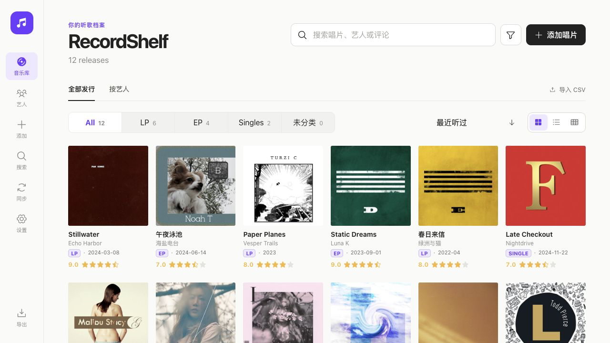

# RecordShelf

一个以个人聆听记录为中心的响应式音乐档案。RecordShelf 可以整理发行、评分、评论和多次收听历史，并在宫格、列表、唱片墙与艺人视图之间切换。



## 目前包含

- 适配桌面与移动端的宫格、列表和唱片墙
- 10 分制评分与 5 星显示（例如 9 分 = 4.5 星）
- 每次收听、评分和评论独立保留
- 艺人别名、合作署名和 MusicBrainz ID 管理
- CSV 导入与 NeoDB 增量同步流程
- Apple Music、Spotify 和 NeoDB 外链
- 发行类型、日期及其他已核验元数据筛选
- NeoDB 地址规范化和疑似重复条目人工处理

## 隐私边界

这个仓库只包含应用代码、匿名合成示例和公开预览图。真实音乐库、评论、评分、同步备份与历史截图保留在本机的 `app/.private/` 和 macOS `Application Support/RecordShelf/`，不会提交到 GitHub。

Vite 使用两种明确的数据模式：

- `npm run dev`：若存在 `app/.private/neodb-library.local.json`，读取本机私人音乐库；否则显示匿名示例。
- `npm run build`：无论本机是否有私人文件，都只打包匿名示例，适合 GitHub、预览站点和公开部署。

请勿移除 `.gitignore` 中的隐私规则，也不要把 OAuth token、NeoDB 导出文件或应用备份复制到 `src/`、`public/`、`docs/` 或其他会被提交的目录。

## 本地运行

需要 Node.js 20 或更高版本。

```bash
cd app
npm install
npm run dev
```

打开 `http://127.0.0.1:4173`。

导入 NeoDB CSV 时，脚本默认把规范化结果写入被忽略的本机数据目录：

```bash
cd app
npm run import:neodb -- "/absolute/path/to/music_mark.csv"
```

修改本机数据前建议同时备份：

- `app/.private/`：基础音乐目录；
- `~/Library/Application Support/RecordShelf/shared-local-state.json`：
  Web 与 Mac 共用的删改、合并、艺人映射和同步增量。

这些私人资料都不会由 GitHub 代为备份。

## macOS 本地应用

在 Apple Silicon Mac 上可生成一个不依赖 Codex 的本地应用：

```bash
cd app
npm run build:desktop
```

构建产物位于 `app/desktop-release/`。桌面包会包含构建当时的私人音乐库
快照；运行后与 `4173` Web 版共用同一个 Application Support 增量文件，
所以两端会恢复相同的删除、合并和重复项选择。产物目录已被 Git 忽略，
不要公开上传或分享。安装、资料迁移和
更新说明见 [macOS 本地应用指南](docs/MAC_APP.md)。

## 验证公开构建

```bash
cd app
npm run build
npm test
npm run test:build-privacy
npm run test:sites
npm run preview
```

产品规则、数据模型和迁移约束见 [PRD.md](PRD.md)。

## 项目状态

当前为 local-first MVP。公开仓库用于版本管理和演示；私人音乐数据仍由使用者自行保管与备份。
